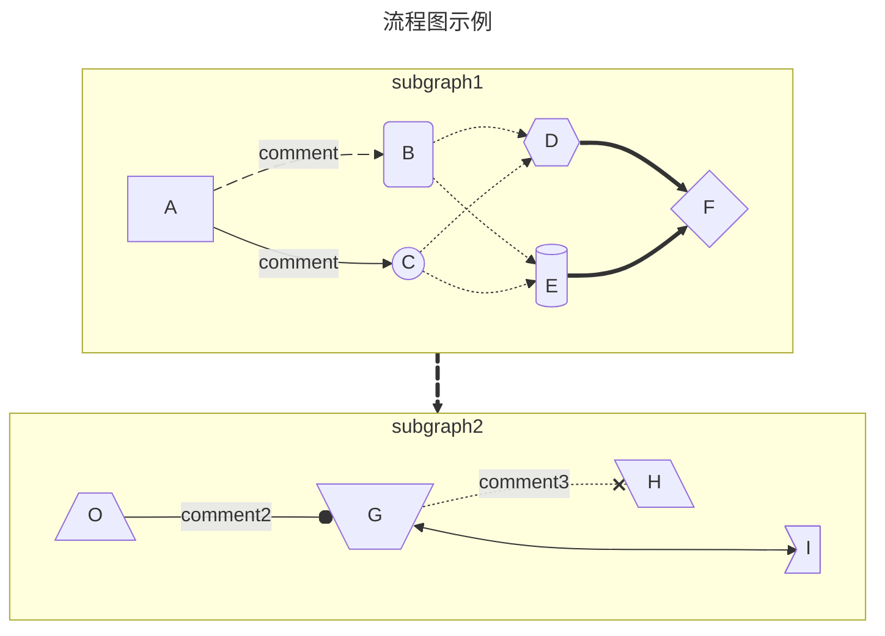
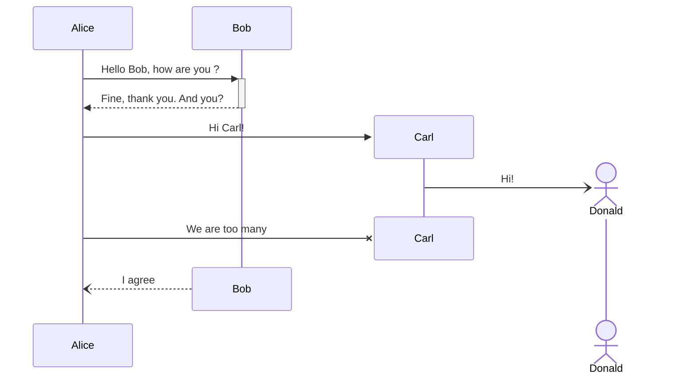
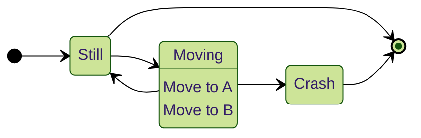
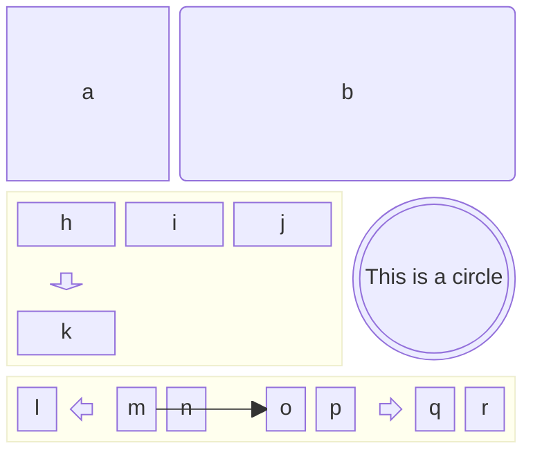
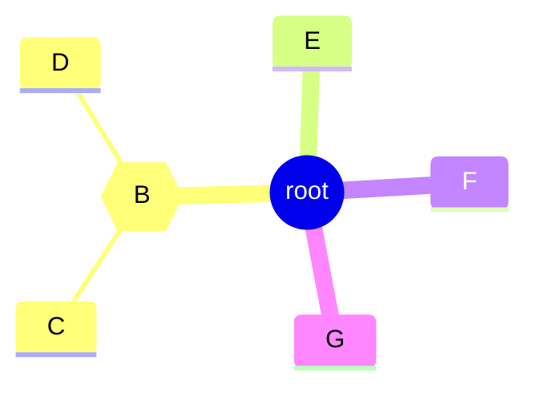
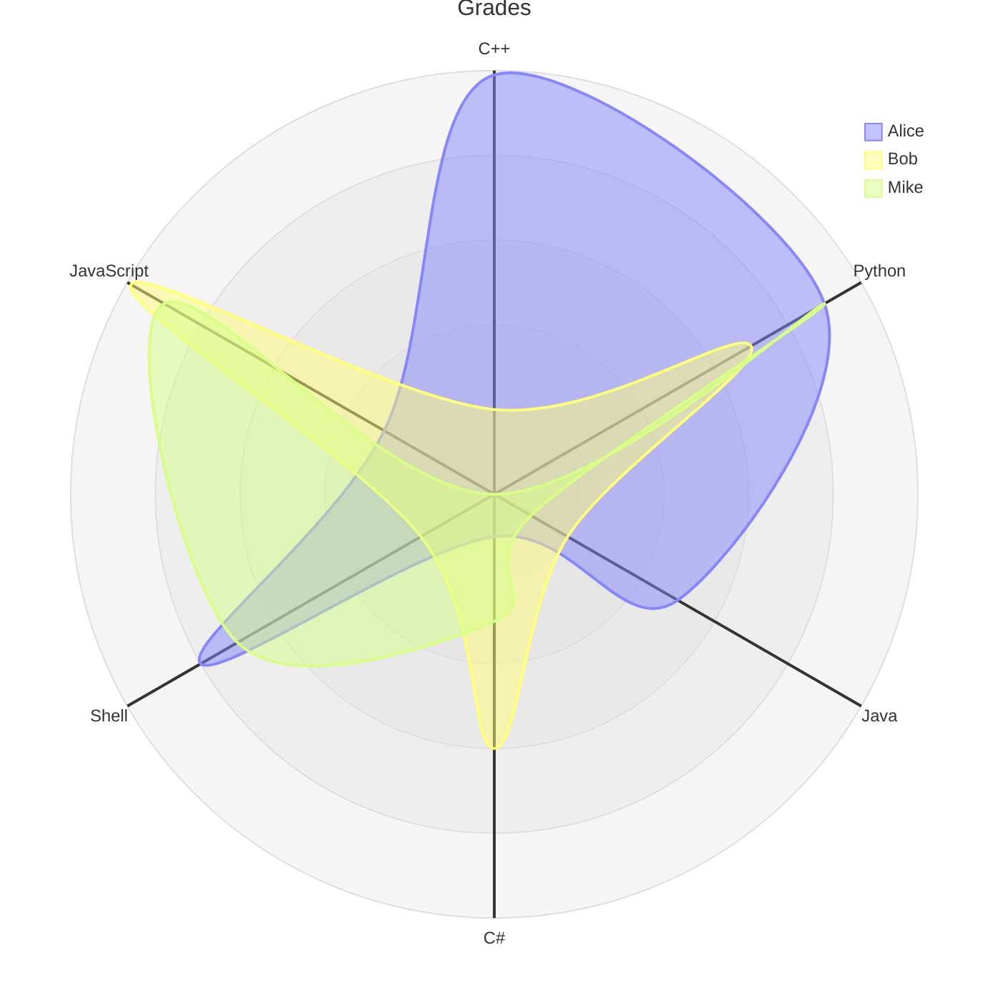
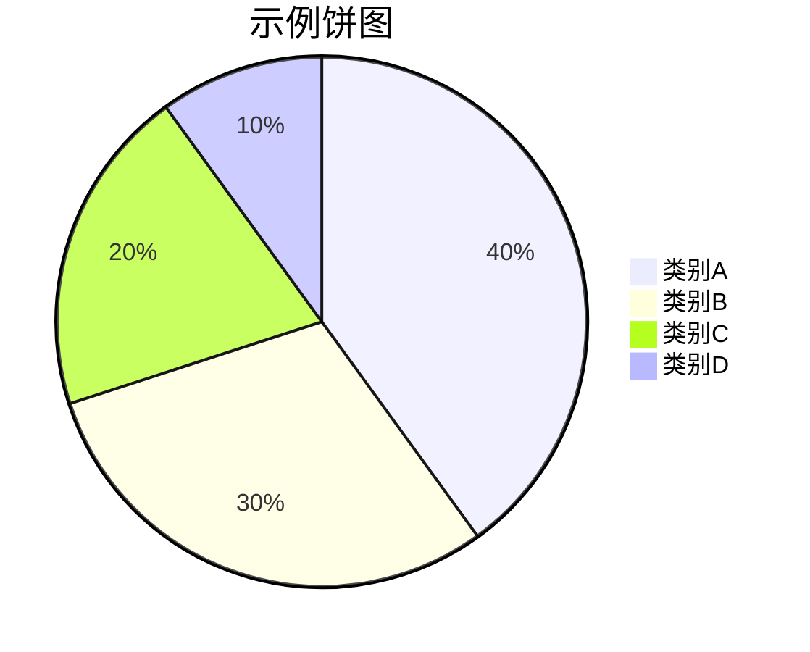
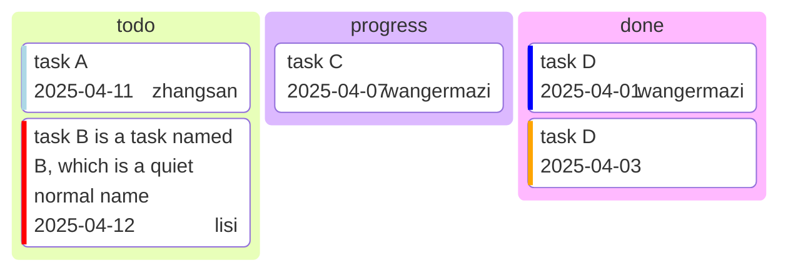
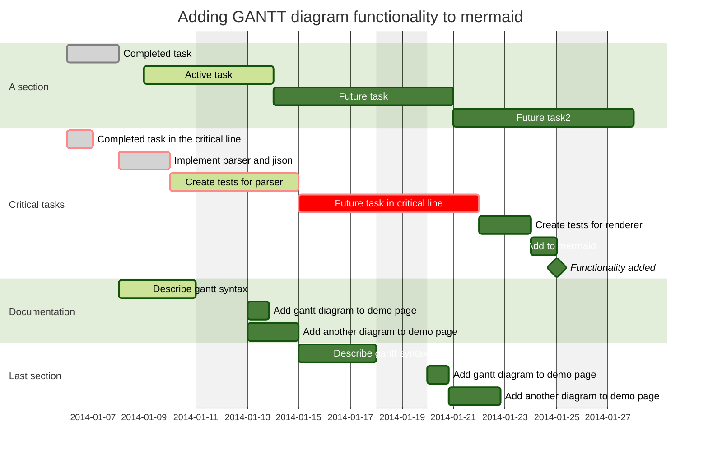

# Mermaid 快速上手

> [!reference]
> - [在线mermaid编辑器](https://mermaid-live.nodejs.cn/edit)
> - [Mermaid中文手册](https://mermaid.nodejs.cn/intro/)

> [!note]
> - 接受 front yaml 进行配置，可以在其中指定主题（`theme: neutral, default, forest`）、字体（`fontFamily: "Maple Mono NF"`）、`title` 等等
> - 图表方向：`LR RL TB/TD BT`

## 流程图 (graph/flowchart)

> [!tip]
> - 支持连对，以及一对多/多对多 `A -> B & C -> D & E -> F`
> - 常见线条：`-.->, ==>, == xx ==>, --->, --.xx.-->` (一个短横是不行的；线上评论要空格)
> - [更多箭头类型](https://mermaid.nodejs.cn/syntax/flowchart.html#new-arrow-types): `--o <--> --x`
> - [箭头动画](https://mermaid.nodejs.cn/syntax/flowchart.html#turning-an-animation-on)：给边打上标记 `A edge001@==> B`，然后配置边的属性 `edge001@{ animate: true }`
> - 常见形状：`() [] (()) [[]] [()] [/\] [\/] [\\] {} {{}} >]`
> - [更多形状](https://mermaid.nodejs.cn/syntax/flowchart.html#complete-list-of-new-shapes) `A@{ shape: processes, label: "Multiple processes" }`

## 时序图 (sequenceDiagram)

> [!note]
> - 箭头有特殊取法，单横线表示实线，双横线表示虚线，单箭头表示没有箭头，双箭头表示有箭头
> - 即 `->> -->>`表示有箭头的实线/虚线，`-> -->` 表示没箭头的实线/虚线
> - 此外还有 双箭头、X、异步调用：`<->, -x, -)`，其实线虚线表示方法不变
> - 跟上加号减号可以描述启动/停止`->>+, -->>-`
> - `participant, actor`
> - `create participant xxx`, `destroy xxx`
> - 此外还有 `loop`, `alt`, `opt` 等类似plantuml的地方，参考[sequenceDiagram](https://mermaid.nodejs.cn/syntax/sequenceDiagram.html#loops)

## 状态图 (stateDiagram-v2)

语法兼容 plantUML。

> [!note]
> - `[*]` 表示 start 和 end，中间节点用线连就行了
> - 节点信息不同于plantUML，但是差别不大。都是 `A: msg1`, `A: another msg` 这样往后加，区别是指定信息后，mermaid会删去A的名字，但是plantUML不会

## 框图 (block-beta)

描述软件架构、组成的图。[Ref](https://mermaid.nodejs.cn/syntax/block.html)

## 思维导图 (mindmap)

只用缩进来描述层级关系

## 雷达图 (radar-beta)

## 饼图 (pie)

## 看板图 (kanban)

> [!note]
> 看板条目格式：`A[description]@{ticket: xx-xx-xx, priority: 'xx', assigned: 'xx'}`
>
> `ticket` 表示时间
>
> `priority` 的取值有 `Very Low, Low, , High, Very High`

## 甘特图 (gantt)

