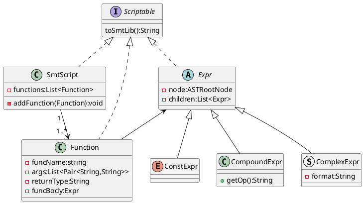
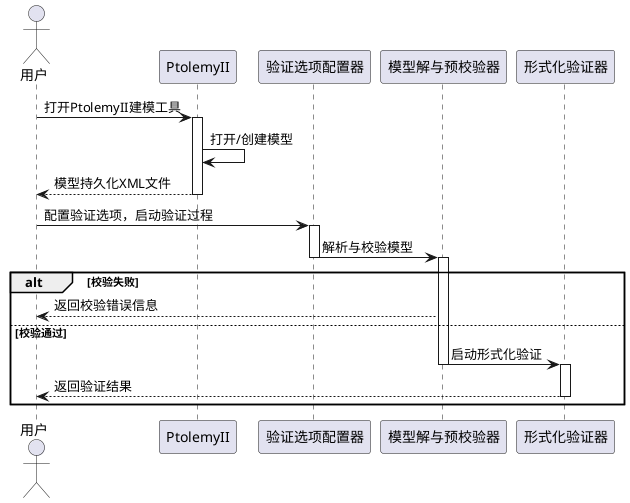
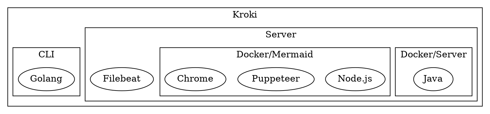
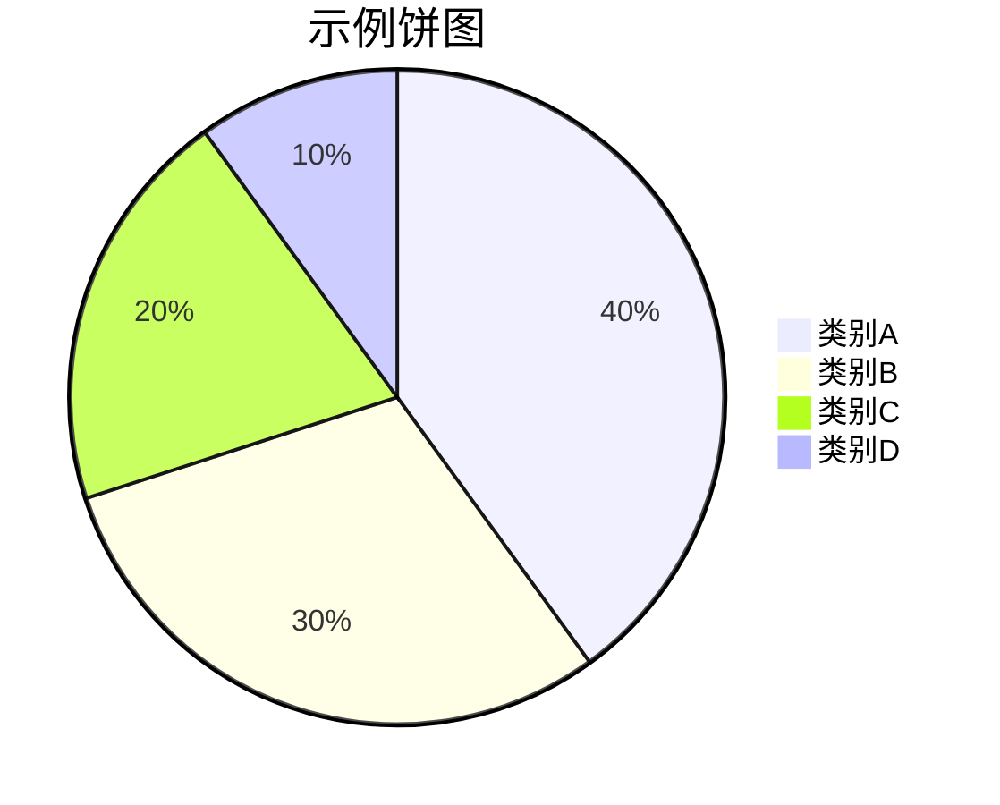

[](https://github.com/captainwc)

# KSimple

Ksimple 是在 [hugo-xmin](https://github.com/yihui/hugo-xmin) 和 [hugo-admonitions](https://github.com/KKKZOZ/hugo-admonitions) 基础上稍作修改的一个 hugo 主题。比较简单，可能更适合个人使用，因此没有单独发布的打算。

## 样式一览

### 基本元素

**Bold**， _Italic_， <mark>Highlight</mark>， ~~Delete~~，:tent:，😘， `Inline Code`

Reference[^Ref001], Reference2[^x2y]

> this is a blockquote

---

### 公式与内联公式

> [!tip]
> ```
> 内联公式支持 \(...\) 和 $...$ 两种写法；
> 单行公式支持 $$...$$、\[...\]、\begin{equation}...\end{equation} 等等多种写法
> 具体定制参见 https://cdn.jsdelivr.net/gh/captainwc/cdn-release/website/js/auto-render.min.js
> ```

\(x^2 + y^2 = 1\)，$ \frac{x^2}{5} + \frac{y^2}{3} = 1$

$${\sqrt {n}}\left(\left({\frac {1}{n}}\sum _{i=1}^{n}X_{i}\right)-\mu \right)\ {\xrightarrow {d}}\ N\left(0,\sigma ^{2}\right)$$

### 代码块

```cpp copy
#include<iostream>
using namespace std;
int main(){
    cout<<"hello hugo\n";
    return 0;
}
```

```diff
- hallo
+ hello
```

### 列表

- list

1. item

- [ ] todo
- [x] todo

### PlantUML 代码块自动渲染

#### 类图



#### 时序图



#### ebnf

```uml
@startebnf
Type = PrimitiveType | ReferenceType;
PrimitiveType = [Annotation], (NumericType | boolean );
@endebnf

```

......


### kroki渲染（支持mermaid, graphviz, dbml ...）

具体的例子参考 [kroki-examples](https://kroki.io/examples.html)

[](https://kroki.io)

#### graphviz


#### mermaid


#### 流程图
```blockdiag
blockdiag {
  Kroki -> generates -> "Block diagrams";
  Kroki -> is -> "very easy!";

}
```

#### 时序图
```seqdiag
seqdiag {
  browser  -> webserver [label = "GET /seqdiag/svg/base64"];
  webserver  -> processor [label = "Convert text to image"];
  webserver <-- processor;
  browser <-- webserver;
}
```

#### 泳道图
```actdiag
actdiag {
  write -> convert -> image

  lane user {
    label = "User"
    write [label = "Writing text"];
    image [label = "Get diagram image"];
  }
  lane Kroki {
    convert [label = "Convert text to image"];
  }
}
```

#### 词云图(vega实现)
![](https://kroki.io/vega/svg/eNqlWN2O3LYVvvdTEJMCYxez643tdWMDuTCQoilQtEXSxhfOXnBEzoiNJCokNVrZ2iCvkdfrk_T7DjU_mt0N0haYESXy8PD8fudIn54otfhdLEpb68VbtShTauPb5893dqsvty6V3frS-eeZQGaf764v_xV9s1hxa-9MKrHxi6sreS6t25YJE6-miVYb45otZvDMCaMTT_qAe6U-yRWzja4tz096XVlhLdM7XXU2Hshl7itbVDro5HZW7VzsdOU-4sk3aht0XesQVaEbpYvCVhZ0Vhm7s5Vva9ukldrowlUucT7YpMPWJsgH8uBjVG2l08aHOq6UbozSVeV7Velm2-mtvajISPk2uXo6M16qr32P6bBS9tZF4WUelXDPKSodrGqDg7iuGlThm8KGxhrVw-bTJmWbwtN4WZZgQQgerm7txBznNkmVWIWmUUFw5ZqE1UKW17bUO-cDhPxzg_2xhcB2pXpLsuBNV1ilVe0NtdrM5D7wwYnGRrdthD29N9cJzN8ZmgSK1zaV3kCQ4GucN4nRBi-eEU1wdj4Php3sKVrAIvCbr1sfGQL5oJjApJ749aUrSu6nf1SJOLNh4hARnE1yhaKcuoJI3-YbtbGwaRuscQU8HsWQsdAVFYTTIhVYTayzs7uokldb20B96GhnFo0IKbEJOCWVSqumkNgol2yNbR42CIN62rpbW8Vn3O1nLH7sbHCQxON44SCaGl9r11yqv4tXxOqhq0AGigYyWd7E424whcqu7SoGMtnMnPLvn3-BhG1r4U5E1qX6h58HPjmKLUoEIP2S2SMOYXMIkHNobRmDuo1yjKGLmKjmoBBi6y28BE668g1Cq-0kTE8jKba2cBvaX-xGU53EVrJF2TioBae9h0wxWqSh70IOE1FkY3V0awo_iND2Fh6N0e04sR7AjyIkpyUIXcpJZG-TbcTBtBZN9B3g62HIgIHK4LstgkAZx8CAkZCrluLaW1238IUEr7G12IhmLOhDTSL6EvaykfjlYgkTJX3rG18P5DA_8xH1D6gHjHvPrIFDkN3f7NOI0gMJVBwiQ02HokTMFQkWh3YIR-TZzpkcM2rjQkwq-HWHgUZjbgVb0iRgxsRKBMTzvJ-ghzt-MwQg3QCkYnzJVMiIeybxY2Gwmqt1GndaDtgwFeGctoQYU366pu2SrK6Qw0jQiQA5SU0myD6Veo8ssBCSOyudw1jMcwHpEGwZZQS4BXQQfAXDETkTu7b1IR0jbg4HcyDMXqg1A3LnK1rZ1fZip8NA5oQdjTKBBBF6Xa0UzFk6sKMvsTwpN7ONZMCZSZibZkAqchPSLdiLPiAYEPtAqA2xKXQNT2d6SCKwjvC4Fgu8XRMYkPM0bzb5hQk4Ez7WsRSnIgiNi0UHE609EooR5Cp7katR11zIAbNqSMyp3FTGwPk8eCfEyYgFi3ZVEkRYA2ZK5OEPcEZnBOBoS9dk3KYfgHtn5Q1TLAUEOGa4yPjVSzmE7H1wWydWbnxzEWbxlnPosZQjycVfYE-mGwvNVGYmsMiy2YZ1KgImWmfm0T3DuJ19uGgeDqFd165hcUKEauNycBxOAzPxuisQ4TnH6cCzHmEqF9K0THVUGCHwtxbOltSt9GADEwBUNWzvLnbO9vQy-p6BAEfg1DDYqbpzxL5U_4xsNrLGw1l5zHU4MuwmIRj5h6opjcjMvIc15Si90muC6wSOtLOxGzFOzv7c8cAKBdORhav1rknHsgIInlq3Y9lXm67JHHOHVFRdzOAr_Rrg61jWW-AVSjii7aM9t7GoBeV30jDGGSCJmPs0tznnCEk4EJuYWlwEzh38W_mtK1h47DwWmGOoJl1CS5CmBI9DwwINmRBw9sfORRJLXAksSFU8NoM8StjvW5tOXEbYYKkKqBJiik0XwDYo5DhOO6A5fARB4QaUDiTWoa895NC8pK9O5D9pkAD-EgFsNB6qJdIZsfF17Elt09WgYOt36OaAVCm3BZYvAvTk8aR0KNgPFOpjlRaXdEUBr6f7WZpxbdLezovHvpmdimc9q9bkWTIGWt00Eocfva8PvTo88APYHaxxuZiA5ubwagPhmkj8mr3dfDrckWRo5aWo8ADzVifI1pxAFig2zlaGJPJWNVsqdJTNqGA2zJf2rLD64fvv--XNp5eruzkJLNL2Phi-ey2eurG2Yz3gx_Iy9nbs4ogyyb_cYHpn4zj4jv8gl5iv3DAcSUo7lq7GP3KU1cg5G_iPcuGkS_jFMRe0EVE68FLz4kK-RpmZ-PbAilGCHVfPf81LtCBypMSy9Li4clbXI6ZRisZeYzeAY1zzZxtc4McRr04QC2ulNnzgnPH44TDjDG4407uqGnvfVQZqyIAkGwu5Y3hCi2VN_ZeBSi4jtV1SryVP5Sx14-iWOJCUGLCym1Z2XDGyYMjBCAdDEpMpDAggBSkwYBHXmIderkKF0cVmmagzB6gtg82PZX6k1nk0HKhtHuXqZLL3-QodeYOCnof9RKGna-NTNgWfa2QZx8pSdfqDFij9MvtuKa63spTHHr1qHqbHgTS-x1WPMDLoMJhx3cHIm9EHOK7QHX0bR3Y_FeOhsqPfjHD-ehiRbSMr3KjXHpv0VvPNAdtST78TkMYJVkbT8b0Ia9gEjhskDLftGCNA3BGk7HXHrsXPN7BQTw4jGePRbyARoBaCGO7kUeMEt5QcFGhbROWssKiblaWqVHQE9EPDYSRKjcDectzYfqwpUO0huBduEa-cI-FobDx-YaTZfVMNI0WKmqvUiybzfoRQA2blj2jUjgGFk54tDvl_t_p1PCJq4Y1wsVILLQCh2e3PAYQdswDMxavrlbpaqVfXNx9--ukpUA_vuk-fqd-rl89u_o8z-_yl6cFD3eYpALGrLxPq8JdfLr_745_eLVfq9RXkeHl1darqHpef7J9u8mcqKePx8Q9Vha_8EVYPYgIy2XMeF_KLPZY-7b987b9xnaA3xVwcLLCQgsajF5-Za_3mxRck_uz19YvizZXcvnn55vrNHxb3hGYH_YDMe-HkmMMpDN8H5DqKIW0PNx4dgjkkwmxKTXzJ6RGFhAi97zbbQT7qiQ0ztzndGnUL5dPOSXXVlhqJ6ooz8g0AWEjFYSeeuWfeh0IN1RHa23OFyPRvrS5cGmZifP4wk5KZ_lt5XF1e390Lv7v_pS1gfS4q35mz0o1Ohpv5SZafYW9W_7Wvgk-TVWYdBhIqZ_qZC9ArkuJrVmJ2rOqvtkNL9y64k0w4kH6b5bvHWrqcB1i_339SvrdjgoC7B4_4Zp9En79YqevXN2cd0P6r9Itfg4Ind_8BeFv4-A==)

### 图片排版

#### 借用超链接实现浮动

```bash
[<>]()
```

效果看上面那个 github 头像即可

#### div flex

##### 直接指定样式

```bash
<div style="display: flex; gap: 2px; justify-content: center">
    
    
</div>
```

##### 使用预定义样式 `img-align`

只需指定div的class为`img-align`，它会自动将元素<mark>均分</mark>为n份填充，横向排版。

僵硬的地方在于，固定是均分的，所以更适合几张图片大小差不多的情况，否则可能不太协调。

```bash
<div class='img-align'>
    
    
</div>
```

<div class='img-align'>
    
    
    
    
</div>

<div class='img-align'>
    
    
    
    
    
    
    
</div>

#### TODO: 定制 Shotcode

### 目录

暂时不打算给博客添加目录

> [!tip]
> 可以考虑使用浏览器插件[OneToc](https://microsoftedge.microsoft.com/addons/detail/onetoc/jkgapfniamkoblbmbhdjlnfklihlpjmc)，有快捷键 Toggle 的功能，效果已经非常不错了。

[^Ref001]: This is the first reference。Alought it placed at the middle of markdown source, it will be move to the end of the html.
[^x2y]: And this is the second one

---

> [!WARNING] 版权声明
> 以下 callout 块相关的内容（包括本博客的实现）全部来自具有`MIT`开源协议的[hugo-admonitions](https://github.com/KKKZOZ/hugo-admonitions)主题，详情请参考原主题！

### Callout 块展示

> [!NOSUPPORT]
> Helpful advice for doing things better or more easily.

#### GitHub Test

> [!NOTE]
> Useful information that users should know, even when skimming content.

> [!TIP]
> Helpful advice for doing things better or more easily.

> [!IMPORTANT]
> Key information users need to know to achieve their goal.

> [!WARNING]
> Urgent info that needs immediate user attention to avoid problems.

> [!CAUTION]
> Advises about risks or negative outcomes of certain actions.

#### Callout Overview

> [!ABSTRACT]
> Abstract: This paper discusses the advantages and challenges of microservice architecture.

> [!CAUTION]
> Advises about risks or negative outcomes of certain actions.

> [!CODE]
> Code snippet:
>
> ```javascript
> function fetchData() {
>   return axios.get("/api/data");
> }
> ```

> [!CONCLUSION]
> Conclusion: Based on the analysis above, we've decided to implement Docker containerization.

> [!DANGER]
> Danger! Critical security vulnerability detected in the system. Immediate action required.

> [!ERROR]
> Error: Unable to connect to database. Please check your connection settings.

> [!EXAMPLE]
> Example:
>
> ```python
> def hello_world():
>     print("Hello, World!")
> ```

> [!EXPERIMENT]
> Experiment: Testing the impact of new caching strategies on system performance.

> [!GOAL]
> Goal: Reduce service response time by 30% by the end of this quarter.

> [!IDEA]
> Idea: Implement a machine learning-based code quality detection system.

> [!IMPORTANT]
> Key information users need to know to achieve their goal.

> [!INFO]
> System status: All services are operating normally. Current uptime: 99.99%.

> [!MEMO]
> Memo: Technical review meeting scheduled for next Tuesday at 2:00 PM.

> [!NOTE]
> Useful information that users should know, even when skimming content.

> [!NOTIFY]
> System notification: Your password will expire in 30 days.

> [!QUESTION]
> Question: How can we optimize database query performance?

> [!QUOTE]
> "Code is like humor. When you have to explain it, it's bad." - Cory House

> [!SUCCESS]
> Congratulations! Your code has been successfully deployed to production.

> [!TASK]
> To-do list:
>
> - Update documentation
> - Deploy new version

> [!TIP]
> Helpful advice for doing things better or more easily.

> [!WARNING]
> Urgent info that needs immediate user attention to avoid problems.

#### Customization

Choose a callout you prefer and add a title

> [!TIP] Summary
> This is a summary using the `TIP` callout!

> [!IDEA] Summary
> This is a summary using the `IDEA` callout!

#### Header Only Mode

You can choose to only to show the header!

> [!ABSTRACT] This paper discusses the advantages of microservice architecture

> [!CAUTION] Ensure all tests pass before merging to main branch

> [!CODE] Execute `npm install` to install all dependencies

> [!CONCLUSION] We've decided to implement Docker containerization

> [!DANGER] Critical security vulnerability detected in the system

> [!ERROR] Error: Unable to connect to database. Please check your connection settings

> [!EXAMPLE] Git commit message format: "feat: add user authentication"

> [!EXPERIMENT] Testing new caching strategy with Redis

> [!GOAL] Reduce service response time by 30% by the end of this quarter

> [!IDEA] Implement a machine learning-based code quality detection system

> [!IMPORTANT] Please review and update your security settings

> [!INFO] Current system status: All services are operating normally with 99.9% uptime

> [!MEMO] Technical review meeting scheduled for next Tuesday at 2:00 PM

> [!NOTE] Always backup your data before performing system updates

> [!NOTIFY] System notification: Your password will expire in 30 days

> [!QUESTION] How can we optimize database query performance?

> [!QUOTE] "Code is like humor. When you have to explain it, it's bad." - Cory House

> [!SUCCESS] Congratulations! Your code has been successfully deployed to production

> [!TASK] Review and update API documentation by Friday

> [!TIP] Use `Ctrl + C` to quickly terminate a running program

> [!WARNING] Warning: This operation will delete all data
