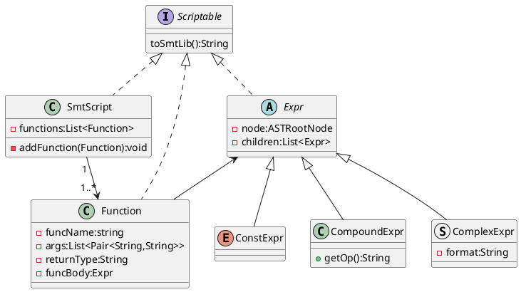
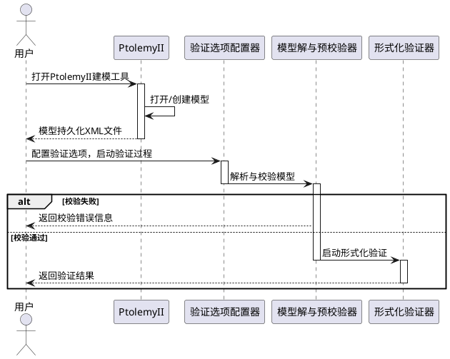
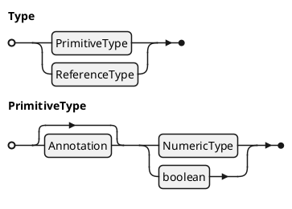

[](https://github.com/captainwc)

# KSimple

Ksimple 是在 [hugo-xmin](https://github.com/yihui/hugo-xmin) 和 [hugo-admonitions](https://github.com/KKKZOZ/hugo-admonitions) 基础上稍作修改的一个 hugo 主题。比较简单，可能更适合个人使用，因此没有单独发布的打算。

## 样式一览

### 基本元素

**Bold**， _Italic_， <mark>Highlight</mark>， ~~Delete~~，:tent:，😘， `Inline Code`

Reference[^Ref001], Reference2[^x2y]

> this is a blockquote

---

### 公式与内联公式

> [!tip]
> ```
> 内联公式支持 \(...\) 和 $...$ 两种写法；
> 单行公式支持 $$...$$、\[...\]、\begin{equation}...\end{equation} 等等多种写法
> 具体定制参见 https://cdn.jsdelivr.net/gh/captainwc/cdn-release/website/js/auto-render.min.js
> ```

\(x^2 + y^2 = 1\)，$ \frac{x^2}{5} + \frac{y^2}{3} = 1$

$${\sqrt {n}}\left(\left({\frac {1}{n}}\sum _{i=1}^{n}X_{i}\right)-\mu \right)\ {\xrightarrow {d}}\ N\left(0,\sigma ^{2}\right)$$

### 代码块

```cpp copy
#include<iostream>
using namespace std;
int main(){
    cout<<"hello hugo\n";
    return 0;
}
```

```diff
- hallo
+ hello
```

### 列表

- list

1. item

- [ ] todo
- [x] todo

### 图片排版

#### 借用超链接实现浮动

```bash
[<>]()
```

效果看上面那个 github 头像即可

#### div flex

```bash
<div style="display: flex; gap: 2px; justify-content: center">
    
    
</div>
```

<div style="display: flex; gap: 2px; justify-content: center; max-width: 90%; text-align: center;">
    
    
</div>

#### TODO: 定制 Shotcode

### PlantUML 代码块自动渲染

#### 类图



#### 活动图



#### ebnf



......

### 目录

暂时不打算给博客添加目录

> [!tip]
> 可以考虑使用浏览器插件[OneToc](https://microsoftedge.microsoft.com/addons/detail/onetoc/jkgapfniamkoblbmbhdjlnfklihlpjmc)，有快捷键 Toggle 的功能，效果已经非常不错了。

[^Ref001]: This is the first reference。Alought it placed at the middle of markdown source, it will be move to the end of the html.
[^x2y]: And this is the second one

---

> [!WARNING] 版权声明
> 以下 callout 块相关的内容（包括本博客的实现）全部来自具有`MIT`开源协议的[hugo-admonitions](https://github.com/KKKZOZ/hugo-admonitions)主题，详情请参考原主题！

### Callout 块展示

> [!NOSUPPORT]
> Helpful advice for doing things better or more easily.

#### GitHub Test

> [!NOTE]
> Useful information that users should know, even when skimming content.

> [!TIP]
> Helpful advice for doing things better or more easily.

> [!IMPORTANT]
> Key information users need to know to achieve their goal.

> [!WARNING]
> Urgent info that needs immediate user attention to avoid problems.

> [!CAUTION]
> Advises about risks or negative outcomes of certain actions.

#### Callout Overview

> [!ABSTRACT]
> Abstract: This paper discusses the advantages and challenges of microservice architecture.

> [!CAUTION]
> Advises about risks or negative outcomes of certain actions.

> [!CODE]
> Code snippet:
>
> ```javascript
> function fetchData() {
>   return axios.get("/api/data");
> }
> ```

> [!CONCLUSION]
> Conclusion: Based on the analysis above, we've decided to implement Docker containerization.

> [!DANGER]
> Danger! Critical security vulnerability detected in the system. Immediate action required.

> [!ERROR]
> Error: Unable to connect to database. Please check your connection settings.

> [!EXAMPLE]
> Example:
>
> ```python
> def hello_world():
>     print("Hello, World!")
> ```

> [!EXPERIMENT]
> Experiment: Testing the impact of new caching strategies on system performance.

> [!GOAL]
> Goal: Reduce service response time by 30% by the end of this quarter.

> [!IDEA]
> Idea: Implement a machine learning-based code quality detection system.

> [!IMPORTANT]
> Key information users need to know to achieve their goal.

> [!INFO]
> System status: All services are operating normally. Current uptime: 99.99%.

> [!MEMO]
> Memo: Technical review meeting scheduled for next Tuesday at 2:00 PM.

> [!NOTE]
> Useful information that users should know, even when skimming content.

> [!NOTIFY]
> System notification: Your password will expire in 30 days.

> [!QUESTION]
> Question: How can we optimize database query performance?

> [!QUOTE]
> "Code is like humor. When you have to explain it, it's bad." - Cory House

> [!SUCCESS]
> Congratulations! Your code has been successfully deployed to production.

> [!TASK]
> To-do list:
>
> - Update documentation
> - Deploy new version

> [!TIP]
> Helpful advice for doing things better or more easily.

> [!WARNING]
> Urgent info that needs immediate user attention to avoid problems.

#### Customization

Choose a callout you prefer and add a title

> [!TIP] Summary
> This is a summary using the `TIP` callout!

> [!IDEA] Summary
> This is a summary using the `IDEA` callout!

#### Header Only Mode

You can choose to only to show the header!

> [!ABSTRACT] This paper discusses the advantages of microservice architecture

> [!CAUTION] Ensure all tests pass before merging to main branch

> [!CODE] Execute `npm install` to install all dependencies

> [!CONCLUSION] We've decided to implement Docker containerization

> [!DANGER] Critical security vulnerability detected in the system

> [!ERROR] Error: Unable to connect to database. Please check your connection settings

> [!EXAMPLE] Git commit message format: "feat: add user authentication"

> [!EXPERIMENT] Testing new caching strategy with Redis

> [!GOAL] Reduce service response time by 30% by the end of this quarter

> [!IDEA] Implement a machine learning-based code quality detection system

> [!IMPORTANT] Please review and update your security settings

> [!INFO] Current system status: All services are operating normally with 99.9% uptime

> [!MEMO] Technical review meeting scheduled for next Tuesday at 2:00 PM

> [!NOTE] Always backup your data before performing system updates

> [!NOTIFY] System notification: Your password will expire in 30 days

> [!QUESTION] How can we optimize database query performance?

> [!QUOTE] "Code is like humor. When you have to explain it, it's bad." - Cory House

> [!SUCCESS] Congratulations! Your code has been successfully deployed to production

> [!TASK] Review and update API documentation by Friday

> [!TIP] Use `Ctrl + C` to quickly terminate a running program

> [!WARNING] Warning: This operation will delete all data
