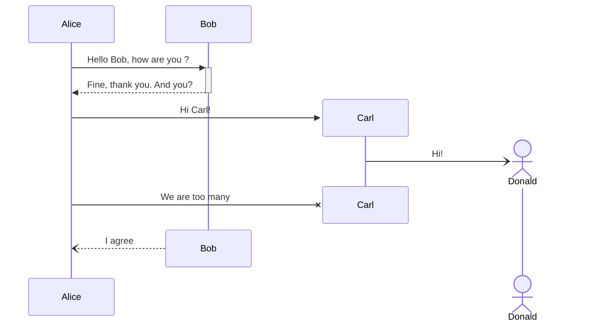
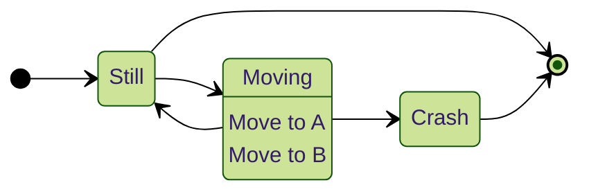
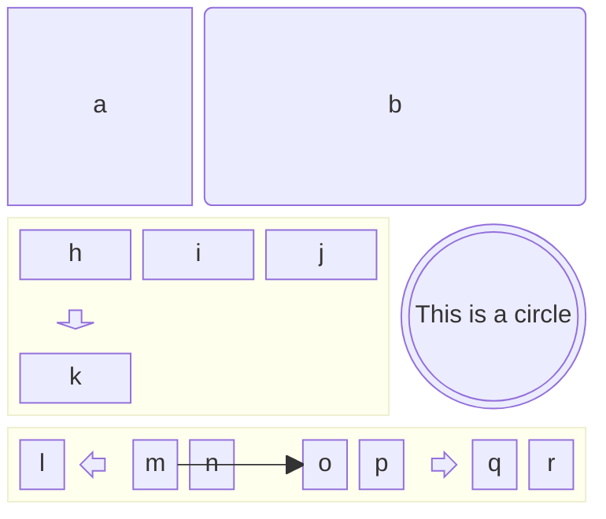
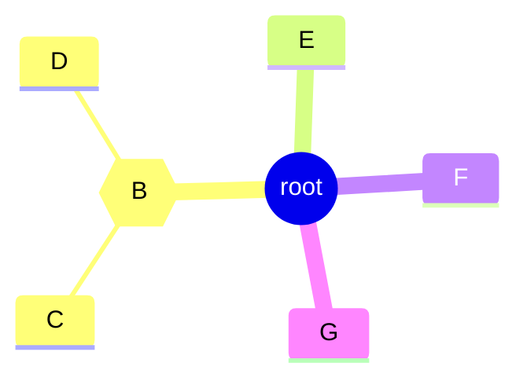
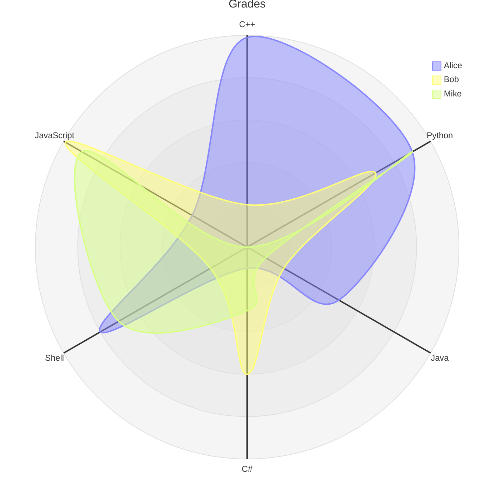
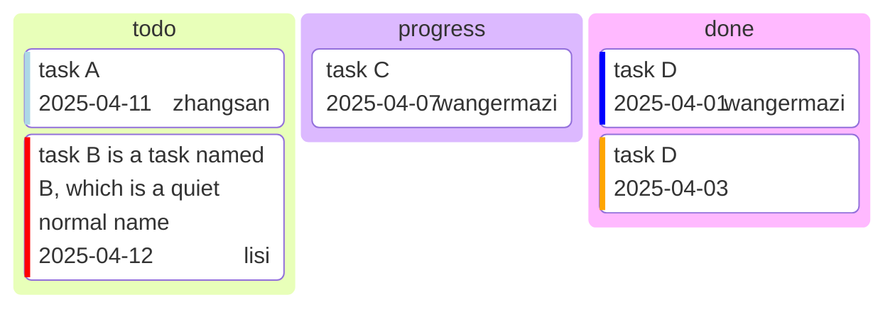
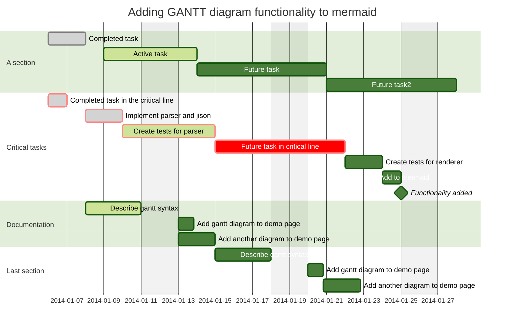

[](https://github.com/captainwc)

# KSimple

[Ksimple](https://github.com/captainwc/ksimple) 是在 [hugo-xmin](https://github.com/yihui/hugo-xmin) 基础上修改而来一个 hugo 主题，加入了目录、mermaid/plantuml等代码渲染图片、代码块高亮复制折叠、模糊查找、评论系统以及其他各类元素样式定制，整体风格力求简约而实用。

## 样式一览

### 基本元素

**Bold**， _Italic_， <mark>Highlight</mark>，==highlight==，H~2~O~2~，X^2^，++insert++，~~Delete~~，:tent:，😘， `Inline Code`

Reference[^Ref001], Reference2[^x2y]

> this is a blockquote

[标题引用](#github-test)，[标题引用2](#kroki渲染支持mermaid-graphviz-dbml-) ：标题名去掉特殊字符(除了-和空格之外的所有，包括但不限于逗号、括号、冒号等)，英文全小写，空格用-替代，然后加上#就是对应的链接了


---

### 公式与内联公式

> [!tip]
> ```
> 内联公式支持 \(...\) 和 $...$ 两种写法；
> 单行公式支持 $$...$$、\[...\]、\begin{equation}...\end{equation} 等等多种写法
> 具体定制参见 https://cdn.jsdelivr.net/gh/captainwc/cdn-release/website/js/auto-render.min.js
> ```

\(x^2 + y^2 = 1\)，$ \frac{x^2}{5} + \frac{y^2}{3} = 1$

$${\sqrt {n}}\left(\left({\frac {1}{n}}\sum _{i=1}^{n}X_{i}\right)-\mu \right)\ {\xrightarrow {d}}\ N\left(0,\sigma ^{2}\right)$$

### 代码块

```cpp copy
#include<iostream>
using namespace std;
int main(){
    cout<<"hello hugo\n";
    return 0;
}
```

```diff
- hallo
+ hello
```

### 列表

- list

1. item

### Todo List

- [ ] todo1
- todo2

- [x]todo3

更推荐下面的用法：

> [!todo] How to use this theme？
> - [x] git clone
> - [ ] modify the `hugo.yaml`
> - [x] create notes
> - [ ] push and public

> [!task] 未来三天计划：
> - [x] 玩一天
> - [x] 玩两天
> - [x] 玩三天

### PlantUML

#### 类图


#### 时序图

```plantuml
@startuml
actor 用户 as user
participant PtolemyII as ptii
participant 验证选项配置器 as config
participant 模型解与预校验器 as parser
participant 形式化验证器 as verifier

user -> ptii++: 打开PtolemyII建模工具
ptii->ptii: 打开/创建模型
return 模型持久化XML文件

user -> config++: 配置验证选项，启动验证过程
config -> parser--++: 解析与校验模型

alt 校验失败
    parser --> user: 返回校验错误信息
else 校验通过
    parser -> verifier--++: 启动形式化验证
    verifier -->user--: 返回验证结果
end

@enduml

```

#### ebnf

```plantuml_kroki
@startebnf
Type = PrimitiveType | ReferenceType;
PrimitiveType = [Annotation], (NumericType | boolean );
@endebnf

```

......

### Mermaid

Mermaid图表使用 mermaid.js 进行渲染

> [!reference]
> 语法参考 [MermaidIntro-ZH](https://mermaid.nodejs.cn/intro/)

#### 流程图 (graph/flowchart)

```mermaid
---
title: 流程图示例
---
graph TB
    subgraph subgraph1
        direction LR
        A[A] e1@-->|comment| B(B) & C((C)) -.-> D{{D}} & E[(E)] ==> F{F}
    end
    subgraph subgraph2
        direction LR
        O[/O\] -- comment2 --o G[\G/] -. comment3 .-x H[\H\]
        G <---> I>I]
    end

    subgraph1 edge002@==> subgraph2

    e1@{ animate: true }
    edge002@{ animate: true }
```



#### 时序图 (sequenceDiagram)



#### 状态图 (stateDiagram-v2)



#### 框图 (block-beta)



#### 思维导图 (mindmap)



#### 雷达图 (radar-beta)



#### 饼图 (pie)

```mermaid
---
config:
    theme: default
---
pie title 示例饼图
    "类别A" : 40
    "类别B" : 30
    "类别C" : 20
    "类别D" : 10
```


#### 看板图 (kanban)



#### 甘特图 (gantt)



### MarkMap渲染

使用 [Markmap.js](https://markmap.js.org/api/) 渲染思维导图，效果如下：

```mindmap
---
title: markmap
markmap:
  colorFreezeLevel: 2
---

## Links

- [Website](https://markmap.js.org/)
- [GitHub](https://github.com/gera2ld/markmap)

## Related Projects

- [coc-markmap](https://github.com/gera2ld/coc-markmap) for Neovim
- [markmap-vscode](https://marketplace.visualstudio.com/items?itemName=gera2ld.markmap-vscode) for VSCode
- [eaf-markmap](https://github.com/emacs-eaf/eaf-markmap) for Emacs

## Features

Note that if blocks and lists appear at the same level, the lists will be ignored.

### Lists

- **strong** ~~del~~ *italic* ==highlight==
- `inline code`
- [x] checkbox-selected
- [ ] checkbox-nonselected
- Katex: $x = {-b \pm \sqrt{b^2-4ac} \over 2a}$ <!-- markmap: fold -->
  - [More Katex Examples](#?d=gist:af76a4c245b302206b16aec503dbe07b:katex.md)
- Now we can wrap very very very very long text based on `maxWidth` option
- Ordered list
  1. item 1
  2. item 2

### Blocks

`console.log('hello, JavaScript')`

| Products | Price |
|-|-|
| Apple | 4 |
| Banana | 2 |


```

至此，已有三种方式实现思维导图：使用Plantuml(效果太简单，但是语法也很简单直观)，使用Mermaid(效果太花哨，像脑图云图之类的)，以及使用Markmind（效果最好的思维导图）

### Kroki渲染

Kroki 支持mermaid, plantuml, graphviz, dbml ... 等很多图表，具体的例子参考 [kroki-examples](https://kroki.io/examples.html)。

（不过本站 mermaid 由 mermaid.js 进行渲染，支持更多类型、更多定制、更快；plantuml 使用 plantuml-encoder.js 获取直链，更原汁原味。）

[](https://kroki.io)

#### graphviz


#### 流程图
```blockdiag
blockdiag {
  Kroki -> generates -> "Block diagrams";
  Kroki -> is -> "very easy!";

}
```

#### 时序图
```seqdiag
seqdiag {
  browser  -> webserver [label = "GET /seqdiag/svg/base64"];
  webserver  -> processor [label = "Convert text to image"];
  webserver <-- processor;
  browser <-- webserver;
}
```

#### 泳道图
```actdiag
actdiag {
  write -> convert -> image

  lane user {
    label = "User"
    write [label = "Writing text"];
    image [label = "Get diagram image"];
  }
  lane Kroki {
    convert [label = "Convert text to image"];
  }
}
```

#### 词云图(vega实现)
![](https://kroki.io/vega/svg/eNqlWN2O3LYVvvdTEJMCYxez643tdWMDuTCQoilQtEXSxhfOXnBEzoiNJCokNVrZ2iCvkdfrk_T7DjU_mt0N0haYESXy8PD8fudIn54otfhdLEpb68VbtShTauPb5893dqsvty6V3frS-eeZQGaf764v_xV9s1hxa-9MKrHxi6sreS6t25YJE6-miVYb45otZvDMCaMTT_qAe6U-yRWzja4tz096XVlhLdM7XXU2Hshl7itbVDro5HZW7VzsdOU-4sk3aht0XesQVaEbpYvCVhZ0Vhm7s5Vva9ukldrowlUucT7YpMPWJsgH8uBjVG2l08aHOq6UbozSVeV7Velm2-mtvajISPk2uXo6M16qr32P6bBS9tZF4WUelXDPKSodrGqDg7iuGlThm8KGxhrVw-bTJmWbwtN4WZZgQQgerm7txBznNkmVWIWmUUFw5ZqE1UKW17bUO-cDhPxzg_2xhcB2pXpLsuBNV1ilVe0NtdrM5D7wwYnGRrdthD29N9cJzN8ZmgSK1zaV3kCQ4GucN4nRBi-eEU1wdj4Php3sKVrAIvCbr1sfGQL5oJjApJ749aUrSu6nf1SJOLNh4hARnE1yhaKcuoJI3-YbtbGwaRuscQU8HsWQsdAVFYTTIhVYTayzs7uokldb20B96GhnFo0IKbEJOCWVSqumkNgol2yNbR42CIN62rpbW8Vn3O1nLH7sbHCQxON44SCaGl9r11yqv4tXxOqhq0AGigYyWd7E424whcqu7SoGMtnMnPLvn3-BhG1r4U5E1qX6h58HPjmKLUoEIP2S2SMOYXMIkHNobRmDuo1yjKGLmKjmoBBi6y28BE668g1Cq-0kTE8jKba2cBvaX-xGU53EVrJF2TioBae9h0wxWqSh70IOE1FkY3V0awo_iND2Fh6N0e04sR7AjyIkpyUIXcpJZG-TbcTBtBZN9B3g62HIgIHK4LstgkAZx8CAkZCrluLaW1238IUEr7G12IhmLOhDTSL6EvaykfjlYgkTJX3rG18P5DA_8xH1D6gHjHvPrIFDkN3f7NOI0gMJVBwiQ02HokTMFQkWh3YIR-TZzpkcM2rjQkwq-HWHgUZjbgVb0iRgxsRKBMTzvJ-ghzt-MwQg3QCkYnzJVMiIeybxY2Gwmqt1GndaDtgwFeGctoQYU366pu2SrK6Qw0jQiQA5SU0myD6Veo8ssBCSOyudw1jMcwHpEGwZZQS4BXQQfAXDETkTu7b1IR0jbg4HcyDMXqg1A3LnK1rZ1fZip8NA5oQdjTKBBBF6Xa0UzFk6sKMvsTwpN7ONZMCZSZibZkAqchPSLdiLPiAYEPtAqA2xKXQNT2d6SCKwjvC4Fgu8XRMYkPM0bzb5hQk4Ez7WsRSnIgiNi0UHE609EooR5Cp7katR11zIAbNqSMyp3FTGwPk8eCfEyYgFi3ZVEkRYA2ZK5OEPcEZnBOBoS9dk3KYfgHtn5Q1TLAUEOGa4yPjVSzmE7H1wWydWbnxzEWbxlnPosZQjycVfYE-mGwvNVGYmsMiy2YZ1KgImWmfm0T3DuJ19uGgeDqFd165hcUKEauNycBxOAzPxuisQ4TnH6cCzHmEqF9K0THVUGCHwtxbOltSt9GADEwBUNWzvLnbO9vQy-p6BAEfg1DDYqbpzxL5U_4xsNrLGw1l5zHU4MuwmIRj5h6opjcjMvIc15Si90muC6wSOtLOxGzFOzv7c8cAKBdORhav1rknHsgIInlq3Y9lXm67JHHOHVFRdzOAr_Rrg61jWW-AVSjii7aM9t7GoBeV30jDGGSCJmPs0tznnCEk4EJuYWlwEzh38W_mtK1h47DwWmGOoJl1CS5CmBI9DwwINmRBw9sfORRJLXAksSFU8NoM8StjvW5tOXEbYYKkKqBJiik0XwDYo5DhOO6A5fARB4QaUDiTWoa895NC8pK9O5D9pkAD-EgFsNB6qJdIZsfF17Elt09WgYOt36OaAVCm3BZYvAvTk8aR0KNgPFOpjlRaXdEUBr6f7WZpxbdLezovHvpmdimc9q9bkWTIGWt00Eocfva8PvTo88APYHaxxuZiA5ubwagPhmkj8mr3dfDrckWRo5aWo8ADzVifI1pxAFig2zlaGJPJWNVsqdJTNqGA2zJf2rLD64fvv--XNp5eruzkJLNL2Phi-ey2eurG2Yz3gx_Iy9nbs4ogyyb_cYHpn4zj4jv8gl5iv3DAcSUo7lq7GP3KU1cg5G_iPcuGkS_jFMRe0EVE68FLz4kK-RpmZ-PbAilGCHVfPf81LtCBypMSy9Li4clbXI6ZRisZeYzeAY1zzZxtc4McRr04QC2ulNnzgnPH44TDjDG4407uqGnvfVQZqyIAkGwu5Y3hCi2VN_ZeBSi4jtV1SryVP5Sx14-iWOJCUGLCym1Z2XDGyYMjBCAdDEpMpDAggBSkwYBHXmIderkKF0cVmmagzB6gtg82PZX6k1nk0HKhtHuXqZLL3-QodeYOCnof9RKGna-NTNgWfa2QZx8pSdfqDFij9MvtuKa63spTHHr1qHqbHgTS-x1WPMDLoMJhx3cHIm9EHOK7QHX0bR3Y_FeOhsqPfjHD-ehiRbSMr3KjXHpv0VvPNAdtST78TkMYJVkbT8b0Ia9gEjhskDLftGCNA3BGk7HXHrsXPN7BQTw4jGePRbyARoBaCGO7kUeMEt5QcFGhbROWssKiblaWqVHQE9EPDYSRKjcDectzYfqwpUO0huBduEa-cI-FobDx-YaTZfVMNI0WKmqvUiybzfoRQA2blj2jUjgGFk54tDvl_t_p1PCJq4Y1wsVILLQCh2e3PAYQdswDMxavrlbpaqVfXNx9--ukpUA_vuk-fqd-rl89u_o8z-_yl6cFD3eYpALGrLxPq8JdfLr_745_eLVfq9RXkeHl1darqHpef7J9u8mcqKePx8Q9Vha_8EVYPYgIy2XMeF_KLPZY-7b987b9xnaA3xVwcLLCQgsajF5-Za_3mxRck_uz19YvizZXcvnn55vrNHxb3hGYH_YDMe-HkmMMpDN8H5DqKIW0PNx4dgjkkwmxKTXzJ6RGFhAi97zbbQT7qiQ0ztzndGnUL5dPOSXXVlhqJ6ooz8g0AWEjFYSeeuWfeh0IN1RHa23OFyPRvrS5cGmZifP4wk5KZ_lt5XF1e390Lv7v_pS1gfS4q35mz0o1Ohpv5SZafYW9W_7Wvgk-TVWYdBhIqZ_qZC9ArkuJrVmJ2rOqvtkNL9y64k0w4kH6b5bvHWrqcB1i_339SvrdjgoC7B4_4Zp9En79YqevXN2cd0P6r9Itfg4Ind_8BeFv4-A==)

### 图片排版

#### 借用超链接实现浮动

```bash
[<>]()
```

效果看上面那个 github 头像即可

#### div flex

##### 直接指定样式

```bash
<div style="display: flex; gap: 2px; justify-content: center">
    
    
</div>
```

##### 使用预定义样式 `img-align`

只需指定div的class为`img-align`，它会自动将元素<mark>均分</mark>为n份填充，横向排版。

僵硬的地方在于，固定是均分的，所以更适合几张图片大小差不多的情况，否则可能不太协调。

```bash
<div class='img-align'>
    
    
</div>
```

<div class='img-align'>
    
    
    
    
</div>

<div class='img-align'>
    
    
    
    
    
    
    
</div>

#### TODO: 定制 Shotcode

### ShortCodes

#### 内嵌多媒体

##### 内嵌网页 emb-web

用法及效果如下。第二个参数是iframe的宽度，默认值是 `50vh`

```html
<!--实际上应该用{，但是在代码块里的也会被解析，所以用[示意-->
[[< emb-web "https://kaikaixixi.xyz" 36 >]]
```



##### 内嵌图片 emb-img

可以嵌入一些长图。原理是先用图片填充满一个临时html，然后将这个html嵌入到iframe中



### 目录

~暂时不打算给博客添加目录~ 还是做目录了，鼠标悬浮右上角目录按钮，自动弹出目录框并将当前标题滚动到中间位置

> [!tip]
> ~可以考虑~推荐使用浏览器插件[OneToc](https://microsoftedge.microsoft.com/addons/detail/onetoc/jkgapfniamkoblbmbhdjlnfklihlpjmc)，有快捷键 Toggle 的功能，效果~已经非常不错了~也还可以。

[^Ref001]: This is the first reference。Alought it placed at the middle of markdown source, it will be move to the end of the html.
[^x2y]: And this is the second one

---

> [!WARNING] 版权声明
> 以下 callout 块相关的内容（包括本博客的实现）全部来自具有`MIT`开源协议的[hugo-admonitions](https://github.com/KKKZOZ/hugo-admonitions)主题，详情请参考原主题！

### Callout 块展示

> [!NOSUPPORT]
> Helpful advice for doing things better or more easily.

#### GitHub Test

> [!NOTE]
> Useful information that users should know, even when skimming content.

> [!TIP]
> Helpful advice for doing things better or more easily.

> [!IMPORTANT]
> Key information users need to know to achieve their goal.

> [!WARNING]
> Urgent info that needs immediate user attention to avoid problems.

> [!CAUTION]
> Advises about risks or negative outcomes of certain actions.

#### Callout Overview

> [!ABSTRACT]
> Abstract: This paper discusses the advantages and challenges of microservice architecture.

> [!CAUTION]
> Advises about risks or negative outcomes of certain actions.

> [!CODE]
> Code snippet:
>
> ```javascript
> function fetchData() {
>   return axios.get("/api/data");
> }
> ```

> [!CONCLUSION]
> Conclusion: Based on the analysis above, we've decided to implement Docker containerization.

> [!DANGER]
> Danger! Critical security vulnerability detected in the system. Immediate action required.

> [!ERROR]
> Error: Unable to connect to database. Please check your connection settings.

> [!EXAMPLE]
> Example:
>
> ```python
> def hello_world():
>     print("Hello, World!")
> ```

> [!EXPERIMENT]
> Experiment: Testing the impact of new caching strategies on system performance.

> [!GOAL]
> Goal: Reduce service response time by 30% by the end of this quarter.

> [!IDEA]
> Idea: Implement a machine learning-based code quality detection system.

> [!IMPORTANT]
> Key information users need to know to achieve their goal.

> [!INFO]
> System status: All services are operating normally. Current uptime: 99.99%.

> [!MEMO]
> Memo: Technical review meeting scheduled for next Tuesday at 2:00 PM.

> [!NOTE]
> Useful information that users should know, even when skimming content.

> [!NOTIFY]
> System notification: Your password will expire in 30 days.

> [!QUESTION]
> Question: How can we optimize database query performance?

> [!QUOTE]
> "Code is like humor. When you have to explain it, it's bad." - Cory House

> [!SUCCESS]
> Congratulations! Your code has been successfully deployed to production.

> [!TASK]
> To-do list:
>
> - Update documentation
> - Deploy new version

> [!TIP]
> Helpful advice for doing things better or more easily.

> [!WARNING]
> Urgent info that needs immediate user attention to avoid problems.

> [!TODO] TODO
> This is a todo list

> [!flag] FLAG
> This is a flag

> [!bug] BUG
> This is a bug

> [!reference]
> Here are all the references

> [!message]
> Please read these message

> [!ai] AI
> Generated by qwen deepseek chatgpt etc

> [!tldr] TL;DR
> Too long dont read

#### Customization

Choose a callout you prefer and add a title

> [!TIP] Summary
> This is a summary using the `TIP` callout!

> [!IDEA] Summary
> This is a summary using the `IDEA` callout!

#### Header Only Mode

You can choose to only to show the header!

> [!ABSTRACT] This paper discusses the advantages of microservice architecture

> [!CAUTION] Ensure all tests pass before merging to main branch

> [!CODE] Execute `npm install` to install all dependencies

> [!CONCLUSION] We've decided to implement Docker containerization

> [!DANGER] Critical security vulnerability detected in the system

> [!ERROR] Error: Unable to connect to database. Please check your connection settings

> [!EXAMPLE] Git commit message format: "feat: add user authentication"

> [!EXPERIMENT] Testing new caching strategy with Redis

> [!GOAL] Reduce service response time by 30% by the end of this quarter

> [!IDEA] Implement a machine learning-based code quality detection system

> [!IMPORTANT] Please review and update your security settings

> [!INFO] Current system status: All services are operating normally with 99.9% uptime

> [!MEMO] Technical review meeting scheduled for next Tuesday at 2:00 PM

> [!NOTE] Always backup your data before performing system updates

> [!NOTIFY] System notification: Your password will expire in 30 days

> [!QUESTION] How can we optimize database query performance?

> [!QUOTE] "Code is like humor. When you have to explain it, it's bad." - Cory House

> [!SUCCESS] Congratulations! Your code has been successfully deployed to production

> [!TASK] Review and update API documentation by Friday

> [!TIP] Use `Ctrl + C` to quickly terminate a running program

> [!WARNING] Warning: This operation will delete all data

> [!todo] This is a todo list

> [!flag] This is a flag

> [!bug] You found a bug

> [!reference] Refer to wikipieda

> [!message] A message for my readers

> [!AI] Generate by deepseek

> [!tldr] Too long dont read
