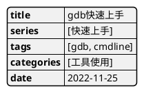
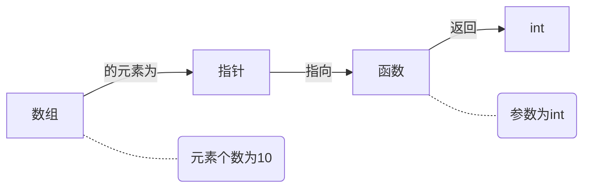
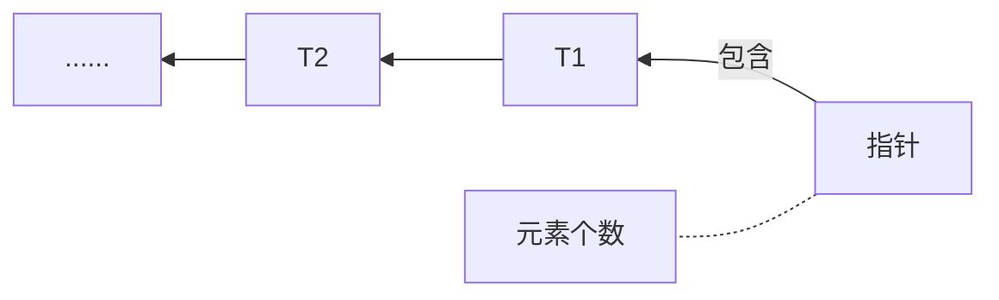
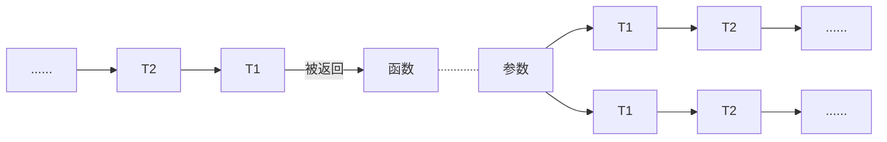

# 征服 C 指针

## 1. 关于指针 初步

### 1.1 指针类型定义

> <strong>指针类型</strong> 可由函数类型、对象类型或不完全的类型派生。派生指针类型的类，称为<mark>引用类型</mark>。指针类型描述这样一个对象：该类对象的值，提供对该引用类型实体的引用。由引用类型 T 派生的指针类型，有时称为*“（指向）T 的指针*。从引用类型构造指针类型的过程，称为*"指针类型的派生”*。这些构造派生类型的方法可以递归地应用。

和基本类型一样，指针也有：指针类型，指针类型的变量，指针类型的值

### 1.2 指针与地址关系

> 指针就是地址。对么？

1. 无论是用`%d, %p, %x`,都能输出指针，指针就是`unsigned int`。似乎这样理解也不无道理。但是需要指出的是，这是与环境有关的。<strong>指针的长度是固定的，无论其是指向什么类型</strong>，可以参见下面的例子：

   ```c
   int    *p1;
   double *p1;
   char   *p3;
   printf("%d %d %d\n", sizeof(p1), sizeof(p2), sizeof(p3));
   // 输出：
   8 8 8
   ```

2. 既然指针是地址，那指向 int 指向 double 有必要区分么？有的。<strong>仅仅告知内存地址，不告知在那个地址上的数据类型，是无法正确取出值来的</strong>。
   题外话，指针的<mark>强制类型转换</mark>，也只是改变对内容的解释方法，指针的长度是固定不变的

   ```c
   int   x = 0x00000041;
   char *p;
   p = (char*)&x;
   pintf("%c\n", p);
   // 输出：
   A
   ```

3. 指针就是地址，对指针 +1，指针不应该就前进一个字节么？
   当然不是，对指针 +n，指针前进“当前指针指向的数据类型长度 $\times$n

### 1.3 空指针

<strong>空指针</strong>

1. 确保它和任何非空指针进行比较都不会相等

2. 只有`NULL`，无论对方指向什么类型，都可以进行赋值和比较

#### 1.3.1 NULL， 0 和 '\0'

在`<stdio.h>`中，NULL 定义如下：`#define NULL 0`，那么空指针不就是为 0 的地址么？大部分环境中确实是这样，但这么说是不准确的。（原作中说的我也没听懂要说什么，但为了便于阅读，还是写 NULL 吧，又不费劲？）不过有一点：_在 C 语言中，当常量 0 处于应该作为指针的上下文中时，他就作为空指针使用_，所以：

```c
int *p = 3; // error! 不能将 int 型赋值给 int* 型
int *q = 0; // 可以，此时等价于， p == NULL
```

<strong>'\0'</strong>即所有位均为 0 的空字符，也即其 ASCII 码为 00000000，空字符'\0'是常量，实际上它等同于 0，但同样的，仍建议不要这样写（<strong>C 语言中，‘\0'呀'a'呀，其类型实际上是 int </strong>而不是 char）

```c
char alp = 'a';
printf("%d %d", sizeof(alp), sizeof('a'));
// 输出：
1 4
```

### 1.4 指针和数组

<mark>这是本书最重要的“一”句话：</mark>

- <strong>在表达式中，数组可以解读成"指向它的初始元素的指针"</strong>，除了

  1. 数组为 `sizeof` 运算符的操作数时，求出的时全体数组元素的大小（在函数中又例外，函数中形参传递的就是指向数组的指针）
  2. 数组为 `&` 运算符的操作数时，（ANSI C 中)返回 指向数组的指针
  3. 初始化数组时的字符串常量
     字符串常量是*char 的数组*，在表达式中通常被解读成*指向 char 的指针*。但在初始化 char 数组时候的字符串常量会作为<mark>被花括号括起来的单个字符</mark>的<mark>省略形式</mark>，被编译器特别解释

- <strong>p[i] 只是 \*(p + i) 的语法糖</strong>，下标运算符[]原本只有这种用法，它和数组无关，不是依赖数组才存在的
  （所以哪怕你写成`i[p]`也是一样可以的。当然，请不要这样写）

一些实验：

```C
// 对于点 1
int nums[N];
int len = sizeof(nums) / sizof(int); //数组元素个数

void(int nums[]);
void(int *nums); // 两种写法是等价的，所以此时nums就是个指针，sizeof(nums) == 8;
// 对于点 3
char str[4] = "abc";
str[0] = 'b'; // 可以, 花括号形式赋值

char *str = "abc";
str[0] = 'b'; // 不可以，指针赋值，指向的是字符串常量（在只读区），常量能改么？

char *str[] = {"abc", "ab"};
str[0][0] = 'b'; // 不可以，str是一个数组，里面存放的是指针，所以对应的”abc“是赋值给指针了

char str[][4] = {"abc", "ab"};
str[0][0] = 'b'; // 可以， str是数组的数组，所以”abc“是赋值给数组，也即花括号形式赋值
```

#### 1.4.1 为什么 C 语言不做数组下标越界检查？

简单来说，C 中访问数组元素，（即使你用的是下标访问法，）都是用指针来进行的。这样的指针可以有很多种，存在于多处、多个源文件中，他们还可以自由的进行加减运算。对编译器来说是很难追踪每一个指针的

### 1.5 函数指针

正如数组在表达式中被解读成指针一样，<strong>函数，也同时是指向函数的指针，这个指针指向函数的初始地址</strong>

#### 1.5.1 ANSI C 标准

- 表达式中的函数，自动转换成指向函数的指针，但是除了作为`sizeof`和`&`的操作符时
- 函数调用运算符`()`的操作数不是函数，而是函数的指针

因此对于指向函数的指针，使用`*`对其解引用，变为函数，但是由于是在表达式中，因此立马又被解释成指向函数的指针，因此，下面这个也是能工作的

```c
void func(int a);
void (*func_p)(int);
func_p = func; // 此时 func 直接可以解释成指向函数的指针
func_p = &func; // 此时 func 不能再解释称函数指针了，因为是 & 的操作数

(****printf)("hello\n"); // 一样正常工作
```

#### 1.5.2 函数指针的用途

- GUI 中的按钮控件记忆“当自身被按下的时候需要调用的函数”
- “指向函数的指针，的数组”，可以避免用 switch

## 2. C 是如何使用内存的

### 2.1 C 的变量种类

#### 2.1.1 作用域

- 全局变量：在函数之外声明，在任何地方可见。即使源文件被分割成多个文件编译，别的文件仍然可见
- 文件内部的静态变量：只限定在当前源代码文件中，用`static`修饰
- 局部变量：只在语句块内被引用

#### 2.1.2 存储期

- 静态存储期：全局变量、文件内 static 变量、指定 static 的局部变量。从程序开始，到程序结束
- 自动存储期：只在代码块{}内存活
- `malloc()`动态分配的内存：直到用`free()`释放

### 2.2 各变量在内存中的位置

#### 2.2.1 函数和字符串常量

函数自身，和字符串常量，汇总配置在一个<strong>只读</strong>的内存区域

#### 2.2.2 静态变量

<strong>静态变量</strong>：包括全局变量，文件内 static 变量，static 指定的局部变量。它们总在<strong>虚拟地址</strong>空间中占有固定区域，从程序启动到结束持续存在。

- 函数和全局变量，如果他们的名称相同，即使跨越了多个源代码文件，也被当作相同的对象来对待。这是由<strong>链接器</strong>负责的

- 为了在链接器中将名称结合起来，各个目标代码(.o)都具备一个<strong>符号表</strong>（可以用`nm`命令查看）
- 自动变量不会出现在符号表中，因为他们是在运行时被决定的，属于链接器管辖范围之外的

#### 2.2.3 自动变量

自动变量重复使用内存区域（<strong>栈</strong>），创建、释放，他们的内存地址是不一定的

##### 2.2.3.1 <strong>函数调用过程</strong>

1. 在<strong>调用方</strong>，参数<strong>从后往前</strong>堆积在栈中【注：先进栈的是参数列表，从右往左！而且，此时由调用函数负责！】
2. 和调用有关的返回信息（<strong>返回地址</strong>等）进栈【注：返回地址在参数之上，因此先返回，参数释放由调用方操作】
3. 跳转到作为<strong>被调用</strong>对象的函数地址
4. 被调函数使用的<strong>自动变量</strong>进栈【注：1-4 增长的栈区域，为被调函数的可引用区域】
5. 被调函数执行过程中，为了进行复杂的表达式运算，有时会向栈中放入结果
6. 被调函数结束，释放自动变量内存，使用返回信息返回【注：此时参数还在栈中】
7. 从栈中去掉调用方的参数【注：所谓传值，即这里的参数是 copy 的，还要被释放】

##### 2.2.3.2 函数栈内存溢出

一旦破坏了自动变量的内存区域，一直往下，就是函数的返回信息。如果数组越界越到了这里，<mark>破坏了返回信息，那么函数将不能再正确返回</mark>。甚至可以通过越界在返回信息处填上别的内容，此即安全漏洞。

##### 2.2.3.3 <strong>可变长参数</strong>

在 2.2.3.1 中提到，C 语言函数的参数进栈，是从后往前的，因此<strong>无论堆积多少参数，总是能知道第一个参数的地址</strong>。利用这点可以实现参数个数不固定的函数

```
void func(char *format,...);
```

函数原型中出现`...`，那么对这一部分是不会进行类型检查的。根据`format`中指出的参数格式，逐个对后面的参数进行处理即可。因为 format 是能找到的，然后只需往栈中向后读取参数就好了。

#### 2.2.4 malloc()分配的内存

1. 返回值为`void*`，即通用型指针，所以不需要进行强制类型转换；分配失败则返回`NULL`

2. 不是系统调用

3. 在"利用`malloc()`分配的内存区域"下面，是一大块空的内存空间。多次调用`malloc()`会调用一次系统调用
   `brc()`，内存区域向地址较大的方向身长（栈是向小地址增长）

##### 2.2.4.1 malloc()分配过程

- `malloc()`遍历链表寻找空的内存块，如果发现尺寸大小合适的块，就将其分割出来，把<strong>管理区域</strong>中的标记变成“使用中的块”，并向应用程序返回<strong>紧邻管理区域的后面</strong>的区域的地址；`free()`则将管理区域中的标记改为“空块”，并顺便将上下空块合并成一个块，防止碎片化。
- 一旦发生<strong>越界</strong>，越过`malloc()`分配的内存区域向后写入数据，就会<mark>破坏后一个块的管理区域</mark>，此后使用 malloc 和 free 就容易出现崩溃了！

##### 2.2.4.2 free()之后可能出现的错误

调用`free()`后，对应的内存块内容不会马上被破坏掉，要等到下次 malloc-->但有可能别的地儿还在使用这块内存（free 早了），所以发现错误较晚-->改写 free，一旦 free 就破坏其中的内容-->可是不知道内存的大小，怎么填充新东西呢？-->再改写 malloc，使得每次分配都预留一小块来设定区域大小信息-->当然，只用于调试版本

## 3. 解读 C 的声明

### 3.1 of-to-returning 读法

1. 首先着眼于<strong>标识符</strong>（变量名或函数名）【先定性，xx 是 xx】

2. 从距离标识符最近的地方开始，依照优先顺序解释派生类型（指针、数组、函数），优先顺序为：

   ① 用于整理声明的<strong>括弧</strong>`()`② 表示<strong>数组</strong>的`[]`，表示<strong>函数</strong>的`()`;③ 表示<strong>指针</strong>的`*`

3. 解释完成派生类型，使用 of to returning 将他们连接起来

4. 最后，追加数据修饰类型修饰符（在左边，int double 等）

```
void (*sinnal(int sig, void (*func)(int)))(int);
```

<strong>读法：</strong>singal is function[sig is int, func is pointer to function(int) <strong>returning</strong> void] <strong>returning</strong> pointer <strong>to</strong> function(int) <strong>returning</strong> void

signal 是一个函数（参数是 int, 和指向返回值为 void 函数的指针），返回值为：指向一个返回值为 void 函数（参数为 int）的指针；

<strong>简写：</strong>

`typedef void(*sig_t)(int);` // 给指向:参数为 int,返回值为 void,的函数 的指针类型,起个别名：sig_t

```
sig_t signal(int sig, sig_t func);
```

#### 3.1.1 const

`const int *p`: p is a pointer to _read-only int_ 指针常量

`int * const p`: p is a _read-only pointer_ to int 常量指针

#### 3.1.2 typedef

### 3.2 C 的数据类型的模型

#### 3.2.1 基本类型和派生类型

<strong>基本类型：</strong>整形（char，int)、浮点型(float,double)
枚举类型：【定义的一些离散变量】【枚举类型 + 基本类型 = 算数类型】
void 类型：【void 表示没有可用的值】
<strong>派生类型：</strong>指针类型，数组类型（元素个数为属性），函数类型（指返回值类型，参数是属性），结构类型，共用体类型

例如，有如下声明：

```
int (*func_table[10])(int a);
```

用链结构图表示类型，链的最前面的元素是基本类型：






- 最开始类型“数组（元素 10）”整和了全体类型的意义，所以将其称为<strong>类型分类</strong>【即“定性”，你到底是个什么东西】

- <mark>从基本类型开始，递归地粘附上派生类型，就可以生成无限类型</mark>

#### 3.2.2 类型的派生

##### 3.2.2.1 指针类型的派生

后面的 T1 T2...统称为<strong>被引用类型 T</strong>


##### 3.2.2.2 数组类型的派生



##### 3.2.2.3 函数类型的派生



- 有特定长度的类型，称为<strong>对象类型</strong>
- 函数类型不是对象类型，因为其没有特定长度
- 数组类型就是将几个派生类型排列而成的类型，其全体长度为`sizeof(T) * len;`,
  因此无法从函数类型派生数组类型（以及其他任何类型），即没有函数的数组（但可以有指向函数的指针的数组）
  也无法从数组类型派生函数类型，因为数组不是标量，不能返回

##### 3.2.2.4 基本类型

|      推荐      | 同义表现                                   | 备注        |
| :------------: | :----------------------------------------- | ----------- |
|      char      | 与下面俩同义，默认是什么需要看具体处理环境 | %c $\pm127$ |
|  signed char   |                                            | %c          |
| unsigned char  |                                            | %c 0~255    |
|     short      | signed short, short int, singed short int  |             |
| unsigned short | unsigned short int                         |             |
|      int       | signed, signed int, 无指定类型             | %d          |
|  unsigned int  | unsigned                                   | %u          |
|      long      | signed long, long int, signed long int     | %ld         |
| unsigned long  | unsigned long int                          |             |
|     float      |                                            | %f          |
|     double     |                                            |             |
|  long double   |                                            |             |

## 零碎

1. `assert()`
2. `scanf()`：返回读取到的字符数，对于未读取的字符，仍保留在流中，可被别的读取！
3. `realloc()`
4. <strong>标量 & 聚合类型</strong>：P15、P83
5. C++中可以将任意指针赋值给 void\*，但是反过来不行，所以 malloc 必须强制类型转换。不过人 C++都用`new`了
6. <strong>内存布局对齐</strong>：结构体中，一些数据类型可能会被配置到比如 4/8 的倍数的地址上，即使它没有这么长。例如：

```c
typedef struct{
    int    a;
    double b;
    char   c;   // 会被自动对齐到 4 的倍数的内存地址上
}hoge;

printf("%d\n", sizeof(hoge));
//输出：
16
```

8. <strong>大端、小端存储</strong>

```c
int              hoge = 0x12345678;
unsigned char *hoge_p = (unsigned  char*)&hoge;

printf("%x %x %x %x\n", hoge_p[0], hoge_p[1], hoge_p[2], hoge_p[3]);
// 输出：
78 56 34 12    // 小端存储
```

9.
