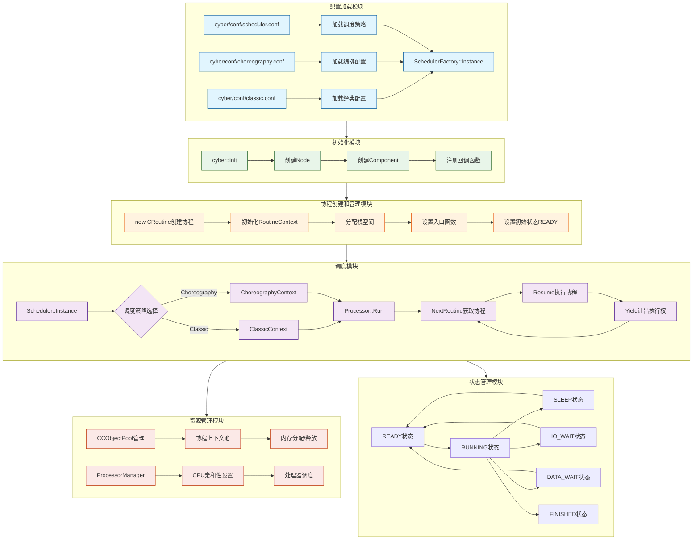

# CyberRT框架总览

## RTPS框架

```mermaid
flowchart TD
    subgraph "Core Layer"
        A["Core Runtime"]:::core
        config["Configuration"]:::config
    end

    subgraph "Communication & Data Transport"
        B1["Transport"]:::comm
        B2["Messaging"]:::comm
        B3["Data"]:::comm
        B4["IO"]:::comm
    end

    subgraph "Scheduling & Task Management"
        C1["Scheduler"]:::sched
        C2["Task Management"]:::sched
        C3["Timer"]:::sched
        C4["Coroutine Handling"]:::sched
    end

    subgraph "Node & Service Management"
        D1["Node"]:::node
        D2["Service"]:::node
        D3["Parameter"]:::node
        D4["Component"]:::node
    end

    subgraph "Discovery & Dynamic Loading"
        E1["Service Discovery"]:::disc
        E2["Class Loader"]:::disc
    end

    subgraph "Logging & Record"
        F1["Logger"]:::log
        F2["Record"]:::log
    end

    subgraph "External Interfaces & Tools"
        G1["Python Interface"]:::external
        G2["Developer Tools"]:::external
    end

    subgraph "Third Party Dependencies"
        H1["Third Party Libraries"]:::third
    end

    %% Core Runtime interactions
    A -->|"publishes"| B2
    A -->|"manages"| B1
    A -->|"manages"| B3
    A -->|"manages"| B4
    A -->|"schedules"| C1
    A -->|"controls"| D1
    A -->|"controls"| D2
    A -->|"controls"| D3
    A -->|"controls"| D4
    A -->|"discovers"| E1
    A -->|"discovers"| E2
    A -->|"logsTo"| F1
    A -->|"recordsTo"| F2
    A -->|"configures"| config

    %% External Interfaces interactions
    G1 -->|"callsAPI"| A
    G2 -->|"monitors"| A

    %% Node and Messaging interaction
    D1 -->|"sendsMsg"| B2

    %% Scheduler internal flow
    C1 -->|"dispatches"| C2
    C1 -->|"fires"| C3
    C1 -->|"orchestrates"| C4

    %% Service Discovery updates
    E1 -->|"updates"| D1
    E1 -->|"updates"| D2

    %% Third Party dependency
    H1 -->|"supports"| A
    
    %% Styles
    classDef core fill:#00ffff,stroke:#000,stroke-width:2px;
    classDef comm fill:#ffcccc,stroke:#ff0000,stroke-width:2px;
    classDef sched fill:#ccffcc,stroke:#008000,stroke-width:2px;
    classDef node fill:#e6ccff,stroke:#0000ff,stroke-width:2px;
    classDef disc fill:#ffffcc,stroke:#cccc00,stroke-width:2px;
    classDef log fill:#ffeecc,stroke:#cc6600,stroke-width:2px;
    classDef external fill:#e0e0e0,stroke:#333333,stroke-width:2px;
    classDef config fill:#d0d0ff,stroke:#000080,stroke-width:2px;
    classDef third fill:#f0e68c,stroke:#b8860b,stroke-width:2px;

    %% Click Events
    click A "https://github.com/captainwc/cyberrt/blob/master/cyber/cyber.cc"
    click config "https://github.com/captainwc/cyberrt/tree/master/cyber/conf"
    click B1 "https://github.com/captainwc/cyberrt/tree/master/cyber/transport"
    click B2 "https://github.com/captainwc/cyberrt/tree/master/cyber/message"
    click B3 "https://github.com/captainwc/cyberrt/tree/master/cyber/data"
    click B4 "https://github.com/captainwc/cyberrt/tree/master/cyber/io"
    click C1 "https://github.com/captainwc/cyberrt/tree/master/cyber/scheduler"
    click C2 "https://github.com/captainwc/cyberrt/tree/master/cyber/task"
    click C3 "https://github.com/captainwc/cyberrt/tree/master/cyber/timer"
    click C4 "https://github.com/captainwc/cyberrt/tree/master/cyber/croutine"
    click D1 "https://github.com/captainwc/cyberrt/tree/master/cyber/node"
    click D2 "https://github.com/captainwc/cyberrt/tree/master/cyber/service"
    click D3 "https://github.com/captainwc/cyberrt/tree/master/cyber/parameter"
    click D4 "https://github.com/captainwc/cyberrt/tree/master/cyber/component"
    click E1 "https://github.com/captainwc/cyberrt/tree/master/cyber/service_discovery"
    click E2 "https://github.com/captainwc/cyberrt/tree/master/cyber/class_loader"
    click F1 "https://github.com/captainwc/cyberrt/tree/master/cyber/logger"
    click F2 "https://github.com/captainwc/cyberrt/tree/master/cyber/record"
    click G1 "https://github.com/captainwc/cyberrt/tree/master/cyber_py3"
    click G2 "https://github.com/captainwc/cyberrt/tree/master/cyber/tools"
    click H1 "https://github.com/captainwc/cyberrt/tree/master/third_party"

```

## CyberRT的协程

```mermaid
graph TB
    %% 定义样式
    classDef configClass fill:#e1f5fe,stroke:#01579b
    classDef initClass fill:#e8f5e9,stroke:#1b5e20
    classDef routineClass fill:#fff3e0,stroke:#e65100
    classDef scheduleClass fill:#f3e5f5,stroke:#4a148c
    classDef resourceClass fill:#fbe9e7,stroke:#bf360c

    %% 配置加载模块
    subgraph ConfigurationModule[配置加载模块]
        A1[cyber/conf/scheduler.conf]:::configClass --> B1[加载调度策略]:::configClass
        A2[cyber/conf/choreography.conf]:::configClass --> B2[加载编排配置]:::configClass
        A3[cyber/conf/classic.conf]:::configClass --> B3[加载经典配置]:::configClass
        B1 & B2 & B3 --> C1[SchedulerFactory::Instance]:::configClass
    end

    %% 初始化模块
    subgraph InitializationModule[初始化模块]
        D1[cyber::Init]:::initClass --> E1[创建Node]:::initClass
        E1 --> F1[创建Component]:::initClass
        F1 --> G1[注册回调函数]:::initClass
    end

    %% 协程创建模块
    subgraph RoutineModule[协程创建和管理模块]
        H1[new CRoutine创建协程]:::routineClass --> I1[初始化RoutineContext]:::routineClass
        I1 --> J1[分配栈空间]:::routineClass
        J1 --> K1[设置入口函数]:::routineClass
        K1 --> L1[设置初始状态READY]:::routineClass
    end

    %% 调度模块
    subgraph SchedulerModule[调度模块]
        M1[Scheduler::Instance]:::scheduleClass --> N1{调度策略选择}:::scheduleClass
        N1 -->|Choreography| O1[ChoreographyContext]:::scheduleClass
        N1 -->|Classic| P1[ClassicContext]:::scheduleClass
        O1 & P1 --> Q1[Processor::Run]:::scheduleClass
        Q1 --> R1[NextRoutine获取协程]:::scheduleClass
        R1 --> S1[Resume执行协程]:::scheduleClass
        S1 --> T1[Yield让出执行权]:::scheduleClass
        T1 --> R1
    end

    %% 资源管理模块
    subgraph ResourceModule[资源管理模块]
        U1[CCObjectPool管理]:::resourceClass --> V1[协程上下文池]:::resourceClass
        V1 --> W1[内存分配/释放]:::resourceClass
        X1[ProcessorManager]:::resourceClass --> Y1[CPU亲和性设置]:::resourceClass
        Y1 --> Z1[处理器调度]:::resourceClass
    end

    %% 状态转换模块
    subgraph StateModule[状态管理模块]
        STATE_READY[READY状态]
        STATE_RUNNING[RUNNING状态]
        STATE_SLEEP[SLEEP状态]
        STATE_IO_WAIT[IO_WAIT状态]
        STATE_DATA_WAIT[DATA_WAIT状态]
        STATE_FINISHED[FINISHED状态]

        STATE_READY --> STATE_RUNNING
        STATE_RUNNING --> STATE_SLEEP
        STATE_RUNNING --> STATE_IO_WAIT
        STATE_RUNNING --> STATE_DATA_WAIT
        STATE_RUNNING --> STATE_FINISHED
        STATE_SLEEP & STATE_IO_WAIT & STATE_DATA_WAIT --> STATE_READY
    end

    %% 模块间的连接
    ConfigurationModule --> InitializationModule
    InitializationModule --> RoutineModule
    RoutineModule --> SchedulerModule
    SchedulerModule --> ResourceModule
    SchedulerModule --> StateModule

    %% 关键文件注释
    %% note1["/cyber/croutine/croutine.h"]
    %% note2["/cyber/scheduler/scheduler.h"]
    %% note3["/cyber/scheduler/processor.h"]
    %% note4["/cyber/croutine/routine_context.h"]
```
