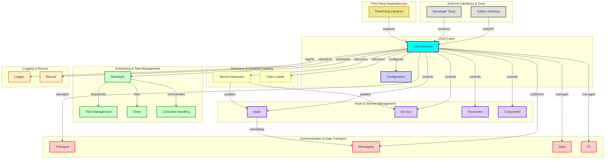

# CyberRT框架总览

## 框架图

```mermaid
flowchart TD
    subgraph "Core Layer"
        A["Core Runtime"]:::core
        config["Configuration"]:::config
    end

    subgraph "Communication & Data Transport"
        B1["Transport"]:::comm
        B2["Messaging"]:::comm
        B3["Data"]:::comm
        B4["IO"]:::comm
    end

    subgraph "Scheduling & Task Management"
        C1["Scheduler"]:::sched
        C2["Task Management"]:::sched
        C3["Timer"]:::sched
        C4["Coroutine Handling"]:::sched
    end

    subgraph "Node & Service Management"
        D1["Node"]:::node
        D2["Service"]:::node
        D3["Parameter"]:::node
        D4["Component"]:::node
    end

    subgraph "Discovery & Dynamic Loading"
        E1["Service Discovery"]:::disc
        E2["Class Loader"]:::disc
    end

    subgraph "Logging & Record"
        F1["Logger"]:::log
        F2["Record"]:::log
    end

    subgraph "External Interfaces & Tools"
        G1["Python Interface"]:::external
        G2["Developer Tools"]:::external
    end

    subgraph "Third Party Dependencies"
        H1["Third Party Libraries"]:::third
    end

    %% Core Runtime interactions
    A -->|"publishes"| B2
    A -->|"manages"| B1
    A -->|"manages"| B3
    A -->|"manages"| B4
    A -->|"schedules"| C1
    A -->|"controls"| D1
    A -->|"controls"| D2
    A -->|"controls"| D3
    A -->|"controls"| D4
    A -->|"discovers"| E1
    A -->|"discovers"| E2
    A -->|"logsTo"| F1
    A -->|"recordsTo"| F2
    A -->|"configures"| config

    %% External Interfaces interactions
    G1 -->|"callsAPI"| A
    G2 -->|"monitors"| A

    %% Node and Messaging interaction
    D1 -->|"sendsMsg"| B2

    %% Scheduler internal flow
    C1 -->|"dispatches"| C2
    C1 -->|"fires"| C3
    C1 -->|"orchestrates"| C4

    %% Service Discovery updates
    E1 -->|"updates"| D1
    E1 -->|"updates"| D2

    %% Third Party dependency
    H1 -->|"supports"| A
    
    %% Styles
    classDef core fill:#00ffff,stroke:#000,stroke-width:2px;
    classDef comm fill:#ffcccc,stroke:#ff0000,stroke-width:2px;
    classDef sched fill:#ccffcc,stroke:#008000,stroke-width:2px;
    classDef node fill:#e6ccff,stroke:#0000ff,stroke-width:2px;
    classDef disc fill:#ffffcc,stroke:#cccc00,stroke-width:2px;
    classDef log fill:#ffeecc,stroke:#cc6600,stroke-width:2px;
    classDef external fill:#e0e0e0,stroke:#333333,stroke-width:2px;
    classDef config fill:#d0d0ff,stroke:#000080,stroke-width:2px;
    classDef third fill:#f0e68c,stroke:#b8860b,stroke-width:2px;

    %% Click Events
    %% click A "https://github.com/captainwc/cyberrt/blob/master/cyber/cyber.cc"
    %% click config "https://github.com/captainwc/cyberrt/tree/master/cyber/conf"
    %% click B1 "https://github.com/captainwc/cyberrt/tree/master/cyber/transport"
    %% click B2 "https://github.com/captainwc/cyberrt/tree/master/cyber/message"
    %% click B3 "https://github.com/captainwc/cyberrt/tree/master/cyber/data"
    %% click B4 "https://github.com/captainwc/cyberrt/tree/master/cyber/io"
    %% click C1 "https://github.com/captainwc/cyberrt/tree/master/cyber/scheduler"
    %% click C2 "https://github.com/captainwc/cyberrt/tree/master/cyber/task"
    %% click C3 "https://github.com/captainwc/cyberrt/tree/master/cyber/timer"
    %% click C4 "https://github.com/captainwc/cyberrt/tree/master/cyber/croutine"
    %% click D1 "https://github.com/captainwc/cyberrt/tree/master/cyber/node"
    %% click D2 "https://github.com/captainwc/cyberrt/tree/master/cyber/service"
    %% click D3 "https://github.com/captainwc/cyberrt/tree/master/cyber/parameter"
    %% click D4 "https://github.com/captainwc/cyberrt/tree/master/cyber/component"
    %% click E1 "https://github.com/captainwc/cyberrt/tree/master/cyber/service_discovery"
    %% click E2 "https://github.com/captainwc/cyberrt/tree/master/cyber/class_loader"
    %% click F1 "https://github.com/captainwc/cyberrt/tree/master/cyber/logger"
    %% click F2 "https://github.com/captainwc/cyberrt/tree/master/cyber/record"
    %% click G1 "https://github.com/captainwc/cyberrt/tree/master/cyber_py3"
    %% click G2 "https://github.com/captainwc/cyberrt/tree/master/cyber/tools"
    %% click H1 "https://github.com/captainwc/cyberrt/tree/master/third_party"

```

