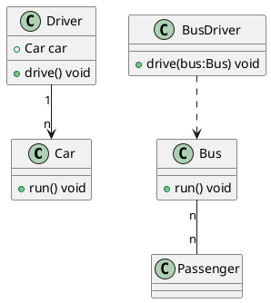
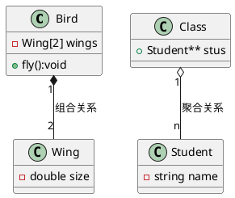
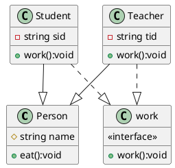

# 设计模式

## 1 关系

### 关联 & 依赖

- **依赖** 表示一种`使用`关系，一个类的实现需要另一个类的协助，因此尽量使用单向的依赖。代码表现为参数依赖、局部变量、静态方法/变量依赖等
- **关联** 偏向一种`拥有`关系，A 拥有 B，即 A 的某个成员，是 B 类的对象，也可以双向拥有，也可以仅仅是存在一种`关联`

> [!note]
> 依赖强调一方要使用另一方、依赖另一方而存在

- 司机拥有了汽车，二者存在关联。
- 公交司机使用公交车进行开车工作，他依赖公交车，但是不拥有公交车。

- 乘客与公交车之间互不依赖互不拥有，但是他们之间确实存在多对多的关系

> [!warning]
> 动物依赖氧气而活，这是依赖关系。动物活着也会与气候发生关系，但是动物不是直接依赖气候而活，因此是关联关系。公交司机之所以是公交司机，是因为有公交车存在，这是依赖关系。

### 组合 & 聚合

聚合和组合都是强调`整体与部分的关系`，也都可以视为一种`关联`关系

- **组合** 是一种`强拥有`关系，部分组装成整体，失去了整体，组装的零件也就没有了存在的意义
- **聚合** 是一种`弱拥有`关系，部分聚集成整体，但是整体解散了部分存在依然有意义

> [!note]
> 聚合的部分可以脱离整体而存在，而组合的部分不能脱离整体而存在

- 翅膀是鸟的组成部分，脱离了鸟，翅膀便不是一个完整的功能部分
- 学生是班级的组成部分，班级解散了，不影响这批学生存在的意义

> [!note]
> 二者与关联关系的区别就在于，聚合与组合，更强调整体与部分之间的关系。鸟与翅膀、班级与学生之间自然存在关联，但他们之间有更进一步的整体部分关系，而非仅仅是关联关系。

### 泛化 & 实现

- **泛化/继承** 是一种类之间的关系，子类继承父类属性和方法，各自有自己的新特性，父类是子类的泛化。
- **实现** 是`接口与实现类`之间的关系。接口是一种抽象的规范，定义了一组方法的签名。一个类通过实现接口来表明它提供了接口中定义的所有方法。实现关系使得**类之间的依赖基于接口而不是具体的实现**。

- 学生和老师都是人，都从 Person 那里继承了属性和方法
- 学生和老师都需要工作，工作的方式和内容五花八门，但是他们都实现了统一的接口 work

> [!note]
> 继承强调类的层次关系，上层是下层的泛化，下层是上层的派生。实现强调的是方法，即定义一组规范接口，让别的类去实现，并没有泛化派生的意味

下图是一张经典的 UML 图：

## 2 SOLID 原则

### 里氏替换原则 LSP

#### 概念

_开闭原则(OCP)背后的主要机制是抽象(abstraction)和多态(polymorphism)。在静态类型语言中，比如 C+和 Java,支持抽象和多态的关键机制之一是继承(inheritance)。正是使用了继承，我们才可以创建实现其基类(base class)中抽象方法的派生类。
是什么设计规则在支配着这种特殊的继承用法呢？最佳的继承层次的特征又是什么呢？怎样的情况会使我们创建的类层次结构掉进不符合 OCP 的陷阱中去呢？这些正是 Liskov 替换原则(LSP)要解答的问题。 ——《敏捷软件开发：原则、模式和设计》_

> Let q(x) be a property provable about objects x of type T . Then q(y) should be true for objects y of type S where S is a subtype of T .

> [!warning]
> 这里需要如下替换性质：若对每个类型 S 的对象 O1，都存在一个 T 类型的对象 O2，使得在针对 T 类型编写的程序 P 中，用 O1 替换 O2 后，程序 p 的行为功能保持不变，则 S 是 T 的子类型

总之就是一句话：

> [!note]
> 子类型必须能够替换掉它们的基类型。说得长一点：当你扩展一个类时， 记住你应该要能在不修改客户端代码的情况下将子类的对象作为父类对象进行传递。

#### 核心理解

在 OOP 中，我们通常是把表现出相同**行为**的一类对象，抽象为一个类。这里要特别注意，也就是说，我们真正看重的，用以标志区分类的，是对象/类的`行为`。

继承是一种`is-a`关系，“派生类，是一种基类”。但是 IS-A 的含义太过宽泛了，在实际编程中可能会与真正的“行为”角度要求有抵触。看两个例子：

- aka 正方形是一种矩形，这个与我们的经验相符，因此矩形类派生出正方形类应该是顺理成章的。但实际上这里也有一些小细节：我们说正方形是矩形，是从内角角度说的，矩形是内角和为 360° 且内角都是 90° 的四边形，正方形也是，因此从内角的行为上来看，正方形是矩形无疑。
  但是如果我**考察的行为是边而不是内角**呢？矩形的长宽是独立变化的，而正方形的长宽是相等的，变化是联动的。也就是说从边的行为上来说，正方形和长方形已经不同了，行为不同，还能说是一类么？这就是经典的<mark>“正方形不是长方形”</mark>

- 同样的，鸵鸟（不会飞）和鸟（会飞），如果我考察的就是飞行能力，比如我要做一个鸟类飞行模拟器，那鸵鸟能继承自鸟类么？显然不能，因为二者行为不一样。但是如果我不看飞行能力，比如做一个鸟类养殖模拟器，那鸵鸟和鸟，都有羽毛都有两个爪子...，鸵鸟又可以从鸟类派生出了，此时鸵鸟是鸟。

正方形是矩形，也不是矩形；鸵鸟是鸟，也不是鸟。这种悖论产生的原因有二[^知乎里氏替换原则]：

1. 继承关系的定义没搞清楚：面向对象的设计关注的是对象的行为，它是使用“行为”来对对象进行分类的，只有行为一致的对象才能抽象出一个类来，而不是拍脑袋决定 is-a

2. 设计要依赖于用户需求和具体环境：需求、关注点不同，关系自然也会不同

LSP 就是一种描述如何设计类继承结构最好，不会出现上述问题的原则。它告诉我们：

> [!note]
> 子类型的正确定义是“可替换性的”，子类对象是可以替换父类对象而保持功能正常的。这里的可替换性可以通过显示或隐式的契约来定义

不满足可替换性，也能写出符合语法的继承结构，也可以工作，但是不总是能正确工作。也即，违背 LSP 的代码，可以正确实现继承、多态等语法功能，但是不见得能满足我们的预期。具体看后面的例子

#### 代码示例

“正方形不是矩形”

<table style="border:none;text-align:center"><tr><td style="width:45%"></td><td style="width:55%"></td></tr></table>

这里多态是能满足的，继承体系从语法上讲是没问题的，但是从预期行为上看是有毛病的。在这里，在边的行为上，Square 不能替换掉 Rectangle，违背了 LSP。

事实上可以重新设计类层次：提取公共部分，创建一个四边形抽象类。关于提取公共部分：

_如果一组类都支持一个公共的职责，那么它们应该从一个公共的超类(superclass)继承该职责。如果公共的超类还不存在，那么就剑建一个，并把公共的职责放入其中。毕竟，这样一个类的有用性是确定无疑的—你已经展示了一些类会继承这些职责。然而稍后对系统的扩展也许会加入一个新的子类，该子类很可能会以新的方式来支持同样的职责。此时，这个新创建的超类可能会是一个抽象类。_

有公共部分，就应当考虑提取出来创建一个新的抽象类。不然就意味着代码面临重复的问题

除了提取公共部分，还有一个原则：

\*继承体系中，应当总是从抽象类继承。也就是说，继承树应该是这么一棵树：**所有有子节点的类都是抽象类，所有具体类都应当是叶子节点\***

#### 具体要求

**基于契约设计（DBC Design By Contract）**

类的编写者可以显示的规定针对该类（父类）的**契约**，客户端的编写者（写子类扩展的人）可以通过契约获悉值得信赖的行为方式。契约即：

> [!note]
> 为每个方法声明前置条件和后置条件。要正确执行一个方法，前置条件必须为真，且执行完之后，要保证后置条件也为真。 前置条件和后置条件的规则是：重新声明的派生类中，只能使用相等或更弱(≤)的前置条件替换原始前置条件，只能使用相等或更强(≥)的后置条件来替换原始后置条件

换句话说，**通过基类接口使用对象的时候，用户只知道前置条件和后置条件**。因此你不能期望用户遵从比基类前置条件更强的前置条件，同时你的行为方式和输出也要跟基类确立的限制一样。

- 参数要广：子类方法的参数类型必须（≥）与其超类的参数类型相匹配或更加抽象
- 返回要细：子类方法的返回值类型必须（≤）与超类方法的返回值类型或是其子类别相匹配
- 子类中的方法不应抛出基础方法预期之外的异常类型
- 子类不应该加强其前置条件，不能削弱其后置条件
- 超类的不变量必须保留
- 子类不能修改超类中私有成员变量的值

比如接口定义输入为整数，那你写的子类就不能要求输入是正整数；接口规定输出是整数，你可以输出正整数，但不能输出浮点数。

> [!warning]
> 父类中的虚函数你可以重写，注意要满足前置条件与后置条件的要求。父类中的别的内容你最好不要修改，因为那个可以理解为是一种规范、约定。

#### 例子

所谓“子承父业”，我现在想为所有**木工**编写一个`Father`类，类中有一个接口叫`earnMoney(Carpentry c1)`，也就是说要挣钱，挣钱的参数是做木工。现在 Father 派生除了子类`Son`和女儿类`Daughter`。

儿子女儿都更新了父亲挣钱的方式，但是这个继承都是很脆弱的。儿子不仅会木工，还会搬砖，当然可以替代父亲（**参数扩大 √**）。但是当妈妈问父亲要钱的时候，她期待的是人民币，换成儿子之后给的可能是 Q 币（**返回值扩大 ×**），那肯定不行。女儿交的是人民币现金，没问题，但是她只会刨木头，仍然替换不了父亲。因此二者都违背了 LSP

后来儿子生了个孙子。孙子会干的活对，拿的钱也没问题，但是孙子有个讲究：工资低于 5000 的话不干（**强化前置条件 ×**），可他爹是不挑剔的。因此孙子替代他爹去干活的时候，也可能会出问题（找不到活儿）。孙女也有个讲究：干完活只收拾锤子，别的不管（**弱化后置条件 ×**)。可惜，工地上贼比较多，孙女不明白他爹这么做的血泪教训。因此代替他爹去干活的第二天，就只剩下个锤子能用了。【以后涨了记性，教育从外孙子干完活不仅收拾自己的家伙儿，连工友的也给收拾了。工地上再也没有丢过东西。(**强化后置条件 √**)】不过这是后话，反正孙子辈也全部违背了 LSP

[^知乎里氏替换原则]: [面向对象基础设计原则：3.里氏替换原则 - 知乎 (zhihu.com)](https://zhuanlan.zhihu.com/p/158386715)
